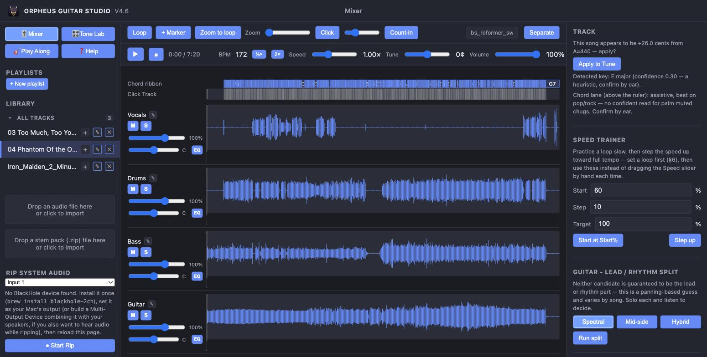
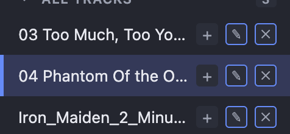
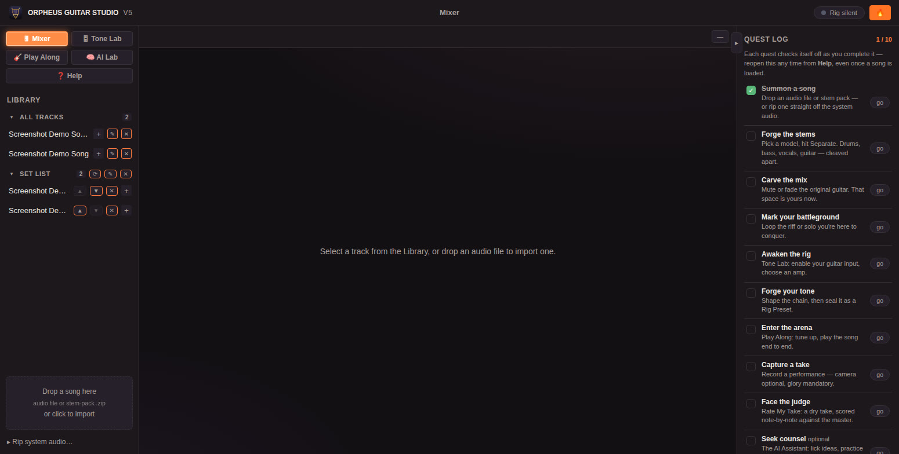
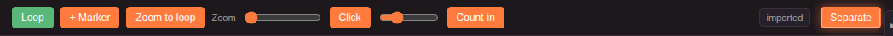
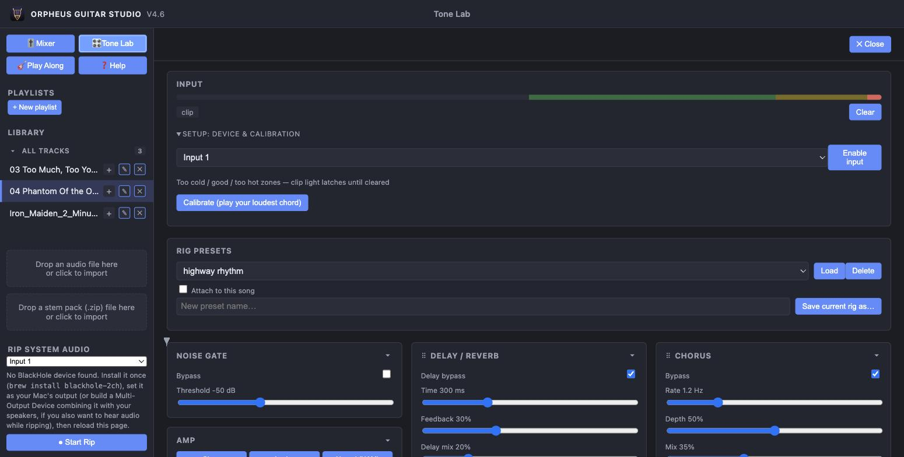
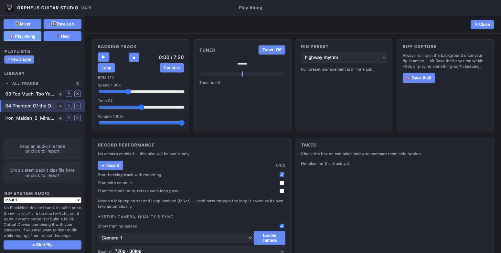
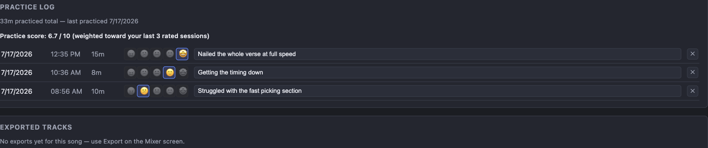

# Orpheus Guitar Studio — User Manual (v4.6)

Everything in this manual exists and works today — nothing here is
aspirational, and nothing below covers how the app used to work. An
in-app **❓ Help** button (sidebar) covers the same essentials for anyone
who won't read this file.

Orpheus Guitar Studio separates a song into stems (vocals/drums/bass/
guitar/piano/other), lets you build a custom backing track by muting/
fading whichever parts you don't want, and gives you a Play Along rig
(amp modeling, effects, cab simulation, a tuner, and performance
recording) to practice or record guitar over the result. Everything runs
locally in your browser, talking to a small Python server on your own
machine — nothing is uploaded anywhere.



**How this manual is organized:**

1. [Setup](#1-setup) — installing the app from scratch, for someone who's
   never used Terminal.
2. [First session checklist](#2-first-session-checklist) — the shortest
   path from a fresh install to your first backing track.
3. [The Mixer](#3-the-mixer) — import, separate, mix, loop, export.
4. [Tone Lab](#4-tone-lab) — build and save a guitar rig.
5. [Play Along](#5-play-along) — practice and record with that rig.
6. [AI Lab](#6-ai-lab-not-yet-built) — planned for v5, not in this build.
7. [Keyboard shortcuts](#7-keyboard-shortcuts)
8. [Troubleshooting](#8-troubleshooting)
9. [Known limitations](#9-known-limitations-by-design-not-oversights)
10. [File locations reference](#10-file-locations-reference)

[TEST-PLAN.md](TEST-PLAN.md) covers the same ground as this manual the
other way round — a regression checklist grouped by app area, for after a
change rather than for a first-time read.

---

## 1. Setup

**Before you start:** a Mac (Apple Silicon is faster for the song-splitting
step, but an Intel Mac works too), about **10GB of free disk space** (the
separation engine pulls down several GB of machine-learning libraries and
model files), and **20–30 minutes**, mostly spent waiting on downloads.
No coding experience needed — every step below is a command you copy and
paste into Terminal, one block at a time.

### 1.1 Open Terminal

Press `Cmd + Space`, type **Terminal**, press Enter. For each command
block below: click into the Terminal window, paste (`Cmd + V`), press
Enter, and wait for it to finish before moving to the next block. A
command that's still running usually shows no obvious sign of progress
for stretches at a time — that's normal, not a hang.

### 1.2 Install Homebrew (skip if you already have it)

Homebrew is the standard way to install developer tools on a Mac. Not
sure if you already have it? Type `brew --version` and press Enter — if
that prints a version number, skip to §1.3.

```bash
/bin/bash -c "$(curl -fsSL https://raw.githubusercontent.com/Homebrew/install/HEAD/install.sh)"
```

It'll ask for your Mac password at some point (typing it shows nothing on
screen — that's normal, not broken) and may print extra instructions at
the end about adding Homebrew to your PATH. If it does, copy-paste and
run whatever command it shows you before continuing.

### 1.3 Install the tools the app needs

```bash
brew install python@3.12 ffmpeg git
```

### 1.4 Download the app

This puts it on your Desktop — feel free to pick somewhere else.

```bash
cd ~/Desktop
git clone https://github.com/chillax7/Guitar-studio.git
cd Guitar-studio
```

### 1.5 One-time setup

```bash
python3.12 -m venv venv
source venv/bin/activate
pip install -r requirements.txt
```

That last command is the slow one — it's installing the actual
song-separation engine (a few GB) and can take 10–15 minutes.

### 1.6 Build the launcher and start the app

```bash
bash scripts/build_app.sh
```

This creates **Guitar Studio.app** inside the folder. Double-click it in
Finder to launch — from now on, that's the only thing you need to do to
open the app.

**First launch only:** macOS will block it because it isn't from the App
Store. Right-click the app → **Open** → **Open** again to confirm. (Or:
System Settings → Privacy & Security → scroll down → **Open Anyway**.)
You only have to do this once. Your browser should then open on its own
to the app.

**Starting it again later:** just double-click **Guitar Studio.app**.
None of the setup steps need repeating.

**Running it by hand instead** (e.g. to watch the server's own log while
it runs):

```bash
source venv/bin/activate
python3 GuitarStudio/server.py --port 8765
```

then open `http://127.0.0.1:8765/` yourself. The server only listens on
`127.0.0.1` (loopback) — nothing outside your Mac can reach it, and
nothing you do in the app is ever uploaded anywhere.

### 1.7 Optional: setting up Rip (system-audio capture)

The Rip feature (§3.2) captures whatever's playing on your Mac straight
into your Library, with no file needed at all. It's genuinely useful, but
it's the one part of setup that asks something of a non-technical user:
routing your Mac's audio through a virtual device. Full walkthrough below
— skip this section entirely if you always work from files you already
have; nothing else in the app needs it.

**What a "virtual audio device" is, in plain terms:** normally, sound
made by any app on your Mac goes straight to your speakers/headphones.
Ripping needs that sound to *also* go somewhere the browser can record
it from — a small piece of free software called BlackHole creates a
fake "audio output" that other apps can capture from, the same way a
real output device works, except nothing plays out of it on its own.

1. **Install BlackHole** (one-time):
   ```bash
   brew install blackhole-2ch
   ```
2. **Set your Mac to output through it.** Open **System Settings → Sound
   → Output**, and pick **BlackHole 2ch**. From this point until you
   switch it back, you'll hear silence from your Mac's speakers — that's
   expected (see step 3 for how to still hear things while ripping).
3. **(Recommended) Build a Multi-Output Device, so you can still hear
   audio while ripping:**
   - Open **Audio MIDI Setup** (press `Cmd + Space`, type it, Enter).
   - Click the **+** in the bottom-left corner → **Create Multi-Output
     Device**.
   - In the list on the right, check both **BlackHole 2ch** and your
     normal output (e.g. "MacBook Pro Speakers").
   - Go back to **System Settings → Sound → Output** and pick this new
     Multi-Output Device instead of plain BlackHole — now sound plays out
     of both your speakers *and* into BlackHole, where the app can
     capture it.
4. **In the app:** reload the page if it was already open. The **Rip
   system audio** card in the sidebar should now show BlackHole (or your
   Multi-Output Device) in its device dropdown instead of the "no
   BlackHole device found" message. See §3.2 for how to actually record.

**One thing worth knowing up front, so it doesn't feel broken later:**
hardware volume keys and the menu-bar volume slider often stop working
normally once BlackHole (or a Multi-Output Device containing it) is your
default output — that's a real limitation of virtual audio devices in
general, not a bug in this app or in BlackHole. The practical fix:
**switch your default output back to your normal speakers/headphones once
you're done ripping** (System Settings → Sound → Output, or the menu-bar
Sound icon if you've enabled it — Control Center → Sound → *Always Show
in Menu Bar*), and only switch to the Multi-Output Device again the next
time you actually want to rip something.

---

## 2. First session checklist

The fastest path from a fresh install to hearing your own backing track.
For a fuller, tickable version of this same walkthrough (progress saved
locally as you go, covering every screen in the app), open
[FIRST-SESSION-CHECKLIST.html](FIRST-SESSION-CHECKLIST.html) directly in
a browser — no server needed.

- [ ] Launch **Guitar Studio.app**; confirm the browser opens on its own
  to the Mixer.
- [ ] Import a song: drag an MP3/WAV onto the sidebar, or click the drop
  zone to pick a file (§3.1).
- [ ] Select it, pick a model (default `bs_roformer_sw` is a good first
  choice), click **Separate** (§3.4) — first run downloads model weights,
  so it's slower than every run after.
- [ ] Once stems load, try muting/soloing a couple of lanes and dragging
  a fader (§3.5).
- [ ] Set an A/B loop on a section you want to practice, turn on **Loop**
  (§3.6).
- [ ] Turn on **Click** and confirm it's audible and in time (§3.5).
- [ ] Export a mix (§3.9) and use **Reveal in Finder** to confirm the
  file is really there.
- [ ] Open **🎛 Tone Lab**, enable your input device (§4.1), pick an amp
  mode, play a note and confirm you hear it processed.
- [ ] Open **🎸 Play Along**, hit **● Record** for a few seconds, stop,
  and confirm the take appears under **Takes** (§5.5).
- [ ] If you plan to use Rip: complete §1.7's BlackHole setup once, then
  do a short test rip (§3.2).

---

## 3. The Mixer

### 3.1 Library & importing songs

The left sidebar's width is adjustable — drag the seam right where it
meets the canvas (cursor turns to ↔) to widen or narrow it, e.g. for
longer song/playlist names; double-click the seam to reset it back to
the default width. It's remembered across reloads.

The left sidebar lists your songs. **All Tracks** is its own collapsible
group (click the ▸/▾ arrow, or its name) and always shows every imported
song, regardless of playlist membership. Drag an audio file onto the
**Drop an audio file here** box (dropping anywhere in the sidebar works,
not just the small box itself — both drop zones highlight blue while
you're dragging over the sidebar, since the browser can't tell which one
a file is headed for until you actually let go), or click it to pick a
file. Large files may take a moment to upload; the drop box shows
"Importing…" while that's in progress. **A file that reads back with
fewer bytes than expected — most often a OneDrive/iCloud file that looks
present in Finder but hasn't actually been downloaded to this Mac yet —
is caught before upload and reported clearly**, with a suggestion to
right-click it in Finder and choose "Download Now" first.

Click any song to select it. A brief **Loading…** state shows while its
stems are being fetched; what you see once that resolves depends on the
song's state:

- **Not separated yet:** you'll see a model picker and a **Separate**
  button (§3.4).
- **Already separated:** the mixer loads immediately, restoring whatever
  mix you last saved for it.
- **Source file changed since separation:** an amber banner offers
  **Re-separate** or **Dismiss** — nothing is ever silently thrown away.

**Renaming and deleting a song** — a ✎ and ✕ button sit next to each
track's name (next to its own **+** for adding it to a playlist, below).
Renaming only touches the source filename; separated stems, saved
mixes/practice history, and any recordings/exports for that song all
follow the rename automatically — nothing is orphaned. Deleting removes
the source file *and* everything derived from it (stems, exports,
recordings) after a confirmation, and drops the song from any playlists
that referenced it.



### 3.2 Rip — capture whatever's playing on your Mac

Don't have the file at all — just something playing in a browser tab,
another app, anywhere on your Mac? The **Rip system audio** card in the
sidebar captures it straight into your Library as a new song. This needs
the one-time BlackHole setup in §1.7. Once that's done: pick your
BlackHole/Multi-Output device in the dropdown, click **● Start Rip**, and
the elapsed time counts up while it records; click **■ Stop Rip**, give
the take a name, and it appears in your Library like any other imported
song.

### 3.3 Importing a stem pack (.zip)

Already have a song split into its parts — a purchased "custom backing
track" pack, a friend's multitrack export, anything pre-split? Skip
separation entirely: click **Drop a stem pack (.zip) file here** (the
box just below the normal drop zone, with the same dashed-border/lighter
fill as the audio drop zone above it — dropping a `.zip` directly onto
the sidebar is auto-detected and routed here too, whichever box it lands
on). Every audio file inside becomes its own stem lane, named exactly as
the file was — long names wrap in the lane header rather than getting
cut off, and each stem's on-screen name can also be renamed independently
(§3.5) without touching the underlying file. The track appears in your
Library immediately, with its own autosaved project and practice log
entry, exactly like any other song. Each stem is converted to WAV on
import but never run through separation — that's the whole point. BPM,
beat grid, chord lane, and key detection all still work on an imported
pack, matching stems by name (anything that looks like a guitar/bass/
piano/drum part) rather than needing the fixed stem names a separation
model produces. If two files in the zip would collide to the same stem
name, the import fails up front with a clear message naming both, rather
than silently overwriting one.

### 3.4 Playlists / setlists

A playlist is its own collapsible group in the same tree as All Tracks,
right there in the Library — no separate playlist picker or management
screen. Create one from any song's own row: click the **+**, then **+ New
playlist…**, give it a name, and it appears alphabetically below All
Tracks with that song already in it. **A song can belong to any number of
playlists at once, and always still shows under All Tracks too** — adding
it to a playlist is never a move, only an extra listing. Add an already-
loaded song to more playlists the same way (click its **+**, tick
whichever playlist(s) you want — the popover closes as soon as you tick
one) or from the playlist's own header (a **+** there adds whatever song
is currently loaded).

Each playlist's header also carries:
- **◀ / ▶** — step to the previous/next song *in that playlist*
  relative to whatever's currently loaded (stops at either end — a
  setlist doesn't wrap around; if the loaded song isn't in this playlist
  at all, jumps to its first song instead).
- **✎ / ✕** — rename or delete the playlist (the songs themselves are
  untouched either way).

Inside an expanded playlist, each song row has **▲ / ▼** to reorder it
and **✕** to remove it from just that playlist (never deletes the song).
Clicking any song, in any group, loads it exactly the same way — a
playlist is only ever an ordering, never a copy of a song's mix/rig
settings.



### 3.5 Separating into stems

A track imported as a stem pack (§3.3) skips this section entirely —
its model badge just reads `imported`, and the mixer is ready the moment
you select it. Everything below is for a normal single-file import.

Pick a model, then **Separate** (styled the same blue as Export — it's the
main action once you've picked a model). This runs entirely on your Mac
(no internet needed after the model weights are cached) and typically
takes somewhere around a quarter to a fifth of the song's length. A
progress bar shows separation is actively progressing — it isn't a
countdown/time estimate, just a heartbeat that something is happening;
watch that 99% doesn't fool you into thinking it's about to finish, since
the last stretch of some models' internal passes can sit there a while.

| Model | Stems | Notes |
|---|---|---|
| `bs_roformer_sw` | vocals, drums, bass, guitar, piano, other | **Default.** Notably better guitar-stem quality than the Demucs models |
| `htdemucs` | vocals, drums, bass, other | Fast, no guitar stem |
| `htdemucs_ft` | same | Slower, slightly cleaner |
| `htdemucs_6s` | + guitar, piano | Also guitar-capable, if you want to A/B against `bs_roformer_sw` |
| `mdx` / `mdx_extra` | vocals, drums, bass, other | Alternative engine |

You can **A/B two models on the same song**: click the model badge in the
toolbar to switch — if that model hasn't been run yet, you'll be prompted
to separate with it too. Nothing is overwritten; both live side by side.

**A separation that reports "failed to fetch" may have actually
finished.** A very long separation holds one connection open for
minutes with no data on it until the very end, which some networks/VPNs/
firewalls treat as "idle" and quietly kill even though the job is still
running server-side. If that happens, the app checks the job's real
status before giving up — if it actually finished, your stems load
normally with no error at all; you'll only ever see a failure message for
a separation that genuinely didn't complete.

**Honest limitation:** even with every stem at full volume and nothing
muted, the recombined mix has a mild "processed" character — that's the
separation engine's quality ceiling, not a bug in your mix.

### 3.6 The Mixer's controls

Each stem is a lane: name (with a small **✎** to rename its display
label — useful for a stem pack import with a long original filename;
this only changes what's shown, never the underlying file or your saved
gain/mute/pan settings for it), **M**(ute)/**S**(olo) buttons, a gain
fader (double-click its percentage to reset to 100%; split-guitar
candidate stems — §3.8 — get extra headroom, up to 300% instead of 150%,
since a panning-based split often leaves one side quiet), a **Pan**
slider (double-click its label to recenter), an **EQ** disclosure
(3-band: bass/mid/treble, ±12dB), and its waveform. **Solo, Pan, and EQ
are all *monitoring* conveniences only — none of them affect what gets
exported (§3.9)**; they're there to help you carve space to play along
(pan the drums off-center, cut some bass mud while you practice), not to
change the mix your export produces.

Playback controls split across two rows. The **top toolbar** (left of the
model badge and Separate button) holds the timeline tools: **Loop**,
**+ Marker**, **Zoom to loop / Zoom out**, a continuous **Zoom** slider,
**Click** plus its own volume slider, and **Count-in**. **Loop, Zoom to
loop/Zoom out, Click, and Count-in all light up solid green while their
state is actually active** (Zoom to loop swaps to a green "Zoom out"
button for as long as the zoomed-to-loop view is showing); every other
button in the toolbar is the app's normal solid blue. The **transport
bar** below it has the playback essentials:

- **Play / Pause / Stop** and the current position. Switching to a
  different song always resets the icon back to ▶, even if the previous
  song was mid-playback when you switched.
- **BPM** — the detected tempo, rounded to the nearest whole number,
  scaling live with the Speed slider. Automatic tempo detection
  occasionally locks onto exactly half or double the real tempo (a
  well-known limitation of tempo estimation, not specific to any one
  song) — the small **½×**/**2×** buttons beside it correct this in one
  click and the fix is remembered for that song from then on.
- **Speed** (0.5×–2×) — changes playback rate while keeping pitch the
  same. Double-click the ×-value to reset to 1.00×.
- **Tune** (±1200 cents = ±1 octave) — shifts pitch independently, at
  the same speed. Fine corrections handle a record that's slightly off
  concert pitch (±100¢ ≈ ±1 semitone); the full-octave range makes it a
  transpose control for playing a song in an easier key. Double-click the
  ¢-value to reset to 0. The inspector panel shows a **detected key** (a
  heuristic — confirm by ear) and, once you move Tune off zero, what key
  that transposition actually lands you in (e.g. "Transposed +2
  semitones → A major"). Once the chord lane (§3.7) has confident chords,
  the key reading is based on those rather than raw pitch-content
  correlation — noticeably more reliable on blues/rock, where a lot of
  dominant-7 chords can otherwise fool a plain major/minor match. The
  tonic is whichever root shows up on the most beats overall (in practice
  usually the actual tonic); major/minor is then judged from the actual
  minor-3rd vs. major-3rd note content at that root, not from a single
  chord's own quality label — power chords (just root + 5th, no 3rd at
  all) can't tell a maj/min template apart on note content alone, so
  trusting one chord's label there was silently biasing riff-heavy rock
  and metal songs toward false "major" reads.
- **Volume** — an overall listening-level slider for the backing track.

And the two toolbar click features:

- **Count-in** — when on, playback (and recording — §5.2) starts after 2
  bars of click, synced to the track's detected BPM.
- **Click** — a metronome click synced to the actual detected beat grid
  (not just an assumed manual BPM, like the count-in). Every 4th beat is
  accented as a downbeat (an assumed 4/4 — there's no time-signature
  detection). Its own volume slider sits right next to it (goes twice as
  loud at full as it used to, for cutting through a busy full-band mix —
  the slider's starting position still gives you the same volume as
  before, only the ceiling moved). Driven from the same per-frame
  position poll the playhead uses rather than pre-scheduled, so it
  tracks Speed and Tune automatically, at the honest cost of a few ms of
  animation-frame jitter versus a real hardware click. If Click is grayed
  out, the track has no beat grid yet — this is analyzed automatically
  when a track is (re)selected, so simply reselecting it turns Click on.

Speed and Tune reset to neutral whenever you switch tracks — a leftover
half-speed setting silently carrying over to a new song would be a trap,
not a feature. **Volume does not reset** on track switch — it's your
listening level, not something that belongs to any one song.



### 3.6a Adding a custom stem

Drag an MP3 or WAV onto the mixer's lane area (anywhere over the
waveforms/ruler, not the sidebar — a dashed overlay reading "Drop to add
as a new stem" confirms you're over the right spot) and it appears as one
more stem, tagged **custom** in its lane header. From that point on it
behaves exactly like every other stem: mute, solo, fader, pan, EQ, mute-
painting, and export all just work, no different treatment needed. Use
it for anything the separation model can't isolate well, or doesn't
produce at all — your own recorded guitar take played over the mix,
a purchased single-instrument backing track, a reference click track.

This needs a track that's **already separated** — drop before that and
you'll be told to separate first, since there's no stem lane to add
alongside yet. A custom stem is remembered for the song itself, not for
whichever separation model happens to be selected — switch between
`htdemucs_6s` and `bs_roformer_sw` to A/B them and it stays put in both,
and re-separating (even with **Re-separate**) never touches it. Dragging
in a new file with the same name replaces the old one, for re-recording
an improved take without any extra cleanup step. A small **✕** next to a
custom stem's name removes it for good (with a confirmation first).

**Positioning a custom stem in the song ("patching"):** a custom stem
doesn't have to start at the beginning — drag its waveform left or right
(cursor turns to ↔ over it) and it slides to wherever you drop it,
leaving blank space before/after the clip in its lane. Useful for
dropping in a short re-recorded piece — just the solo, a fixed verse —
and lining it up with the rest of an already-separated track instead of
re-recording the whole thing. A plain click on a custom stem's waveform
still seeks like any other lane; only an actual drag repositions it.
Export bounces it at wherever you've dropped it, same as what you hear
live. **One current limitation:** repositioning only plays back correctly
with Speed and Tune at their defaults (1.00×/0¢) — with either one moved,
a repositioned custom stem plays from the wrong spot until they're back
to normal.

### 3.7 Timeline, looping, and the chord lane

**Chord ribbon and Click Track stay pinned to the top of the workspace**
as you scroll down through a song with many stems — they never scroll
out of view the way the stem lanes below them do.

Tall waveforms with a paintable mute lane under each stem sit directly
below the transport — click-drag to mute just a section (e.g. a guitar
solo), click an existing region to remove it. This uses exactly the same
`(stem, start, end)` data the export engine does, so what you paint is
exactly what gets exported.

**A/B loop:** drag the two handles on the ruler above the lanes to set a
loop region; the **Loop** button in the toolbar toggles it on/off
(defaults to the whole track the first time you enable it). Click anywhere
on the ruler (not on a handle) to seek. Hold **Alt** while pressing **←/→**
for a finer 100ms nudge (Shift is still the coarse 5s jump) — useful for
lining a loop/mute edge up to an exact transient.

**Waveform zoom:** with a loop set, click **Zoom to loop** in
the toolbar to rescale the ruler and every lane's waveform to fill the
view with just that region — real added detail, not the same picture
stretched, since the waveform re-renders from the source audio at the new
resolution. Everything stays consistent while zoomed: ruler clicks, loop-
handle drags, and mute-region painting all map to time correctly within
the zoomed range; markers/beat-grid ticks outside it simply don't draw.
**Zoom out** returns to the whole track. Zoom is a per-session view aid,
like Speed/Tune — it resets when you switch tracks.

**Continuous zoom:** the **Zoom** slider next to Zoom to loop/Zoom out
works independently of them — instead of narrowing the time range shown
(what Zoom to loop does), it widens the ruler/waveforms/chord lane beyond
the window, scrolling horizontally, up to 24× the fit-to-window size.
Stem names and the Chord ribbon/Click Track row labels stay fixed on the
left as you scroll, same idea as a DAW's frozen track headers. During
playback, the view follows the playhead once it crosses the middle of the
window (GarageBand-style) — it doesn't scroll before then, and it snaps
straight to center on a big jump (a loop wrap, a marker double-click, a
manual seek), rather than leaving the playhead stranded off-screen. The
two zoom controls combine: zoom to a loop first, then drag the slider to
zoom in further within just that region. Double-click the slider to reset
to fit-width. Also a per-session view aid — resets on track switch, same
as Zoom to loop.

**Section markers:** click **+ Marker** in the toolbar to drop a
named marker at the current playhead position (you'll be asked to name
it — "Solo", "Chorus 2", whatever helps). Markers appear as small tags in
a strip above the ruler:
- **Click** a marker to jump the playhead there.
- **Double-click** a marker to loop from it to the *next* marker (or the
  end of the track, if it's the last one) — turns Loop on automatically.
  This is the fast way to isolate a solo: drop a marker where it starts,
  another where it ends, double-click the first.
- Hover a marker to reveal a small **×** to delete it.

Markers are saved per-song, same as everything else in this section.

**Chord lane:** a row of chord chips above the ruler, labeled "Chord
ribbon" (only appears once chord analysis exists — it's computed
automatically alongside BPM/beats/key, so older tracks pick it up the
next time they're selected). Each chip spans one beat-grid interval;
click one to jump the playhead there. This is a **maj/min/7-only
heuristic** — beat-synchronous chroma matched against simple chord
templates, not a real chord-recognition model — assistive and best on
pop/rock, same honesty framing as §3.8's guitar split. A dimmed **?**
chip means no confident read for that beat rather than a guess; zoom in
(above) to actually read the chord names, since a whole song's worth of
chips at full width just reads as a solid bar. Chord roots transpose live
with the Tune slider, same as the Detected Key hint. **Known rough edge:**
on riff-heavy songs, the ribbon can read as busier than the underlying
harmony actually is (individual moving notes flipping the per-beat
read rather than the rhythm part changing chord) — judge by ear, and
treat a wall of rapidly-alternating chips as "this section is
riff-based," not as literal chord-by-chord accuracy.

**Speed Trainer:** in the right-hand inspector — set a loop first
(a marker double-click is the fastest way), then use **Start** / **Step
up** instead of dragging the Speed slider by hand between passes. Start
jumps to a reduced practice speed (default 60%); each **Step up** click
nudges Speed toward Target (default 100%) by Step (default 10 points),
clamping exactly at Target on the last click rather than overshooting.
Practice a hard passage slow, then step it up toward full tempo one clean
pass at a time.

### 3.8 Guitar split (experimental)

Only available once a stem literally named `guitar` exists (i.e. you
separated with a 6-stem-capable model). Opens from the **Guitar - Lead /
Rhythm Split** section in the right-hand inspector once a guitar stem is
loaded.

This is a **stereo-panning heuristic**, not a real lead/rhythm separation
model — no such model exists anywhere as an open weight. The two results
are always labeled **Candidate A (center)** and **Candidate B (sides)** —
never "Lead"/"Rhythm" — because which one is actually which varies by
song and sometimes neither is clean. Solo each and judge by ear. The
correlation number shown is diagnostic only; it does not reliably predict
whether the split will sound good.

Three split algorithms are offered:

- **Spectral** (default) — adapts the center/sides split per frequency
  bin, usually the best starting point.
- **Mid-side** — the blunt whole-track version: one fixed 50/50 split
  applied everywhere. Rarely beats Spectral, kept mainly for comparison.
- **Hybrid** — Spectral, sharpened using how tightly the guitar's note
  onsets line up with the song's detected beat grid. Still not a
  lead/rhythm classifier — it's a confidence tweak on top of the same
  panning read, on the theory that strummed/chordal playing sits at a
  more decisively fixed stereo position than a lead line wandering under
  bends and vibrato. Needs a detected beat grid to do anything (falls
  back to plain Spectral without one — instrumental-only tracks or ones
  where tempo detection failed won't see a difference from Spectral).

None of the three is guaranteed to beat the others on a given song —
try more than one and judge by ear, same as always.

### 3.9 Export

The **Export** section is always visible in the right-hand inspector once a
track's stems are loaded — no separate button to click to reveal it.
**Export bounces exactly what you hear** (except solo, which is
monitoring-only). Options:

- **Format:** WAV or MP3.
- **Output name** — the field's placeholder text (`e.g.
  backing_track.wav`) is just an example, not a default that's already
  filled in; leave it blank and the app names the file for you.
- **Target LUFS** (default −14).
- **Normalize loudness** — on by default; turn off to skip loudness
  correction entirely.
- **Max boost cap** (default +10 dB) — quiet/solo mixes can need a large
  corrective boost to hit the target loudness, which makes separation
  artifacts more audible. The cap limits how far that boost goes; you'll
  see a note if it was hit and the target wasn't fully reached.
- A peak-safety clamp (to about −0.2 dBFS) is automatic, not adjustable —
  it only fires as a last resort if normalization would otherwise clip.

Exported files land in `output/<song name>/`, alongside a model-prefixed
copy of every stem you've separated for that song. After a successful
export you get a **Reveal in Finder** shortcut straight to it — and the
file also shows up immediately in Play Along's **Exported Tracks** card
(§5.9) if that screen is open.

---

## 4. Tone Lab

The rig lives across two screens, plus the mixer you started in and
Help — four equally-reachable buttons in the top-left of the sidebar
(**🎚 Mixer**, **🎛 Tone Lab**, **🎸 Play Along**, **❓ Help**). Both rig
screens share the exact same audio engine as the mixer (not a second,
separate audio session) — backing-track playback and your live guitar mix
together naturally, with no added round-trip latency from the recording
or mixing side. The split is by *task*, not by feature: **Tone Lab** is
where you build/tweak the sound (input, amp, cab, all 12 pedal cards, rig
presets); **Play Along** (§5) is where you practice and record with a rig
you've already dialed in. Selecting a track in the Library always drops
you back to the Mixer, closing whichever of the two rig screens was open.

Tone Lab's rig is a row of small icon chips — Gate, Amp, then every pedal,
then Output — in left-to-right signal order, wrapping to a second row if
your window's narrow. Click an icon to open its controls in the panel
below; only one panel is open at a time, so you're never scrolling past
fourteen other cards to find the one you want. An icon lights up (blue)
when its stage is active and dims when bypassed — a glance at the row
tells you what's actually in the signal path before you open anything.
The icon row's own left-to-right order **is** the signal-chain order, so
there's no separate diagram to keep in sync with it.



### 4.1 Input

The input meter, clip light, and a **Setup: device & calibration**
disclosure sit in Tone Lab's top strip. Expand **Setup**, pick your audio
interface/microphone, and click **Enable input** — the browser will ask
for microphone permission once. "Enable Input" prefers a remembered
device (whichever you used last time) or, failing that, any input that
doesn't look like a built-in microphone — a Mac's built-in mic monitored
through speakers into an amp/distortion chain is a feedback loop, so
guessing an external interface first matters. Switching the device
dropdown while already enabled re-enables input on the new device
automatically. The Setup disclosure stays open once expanded — collapse
it yourself if you want the space back. The meter shows input level with
too-cold/good/too-hot zones; a **clip** light latches on if a transient
clips (it doesn't self-clear — click **Clear**, or start a new input
session, once you've noted it and fixed your gain staging). **Calibrate
(play your loudest chord)**, inside Setup, listens for 3 seconds and
suggests an output trim so your loudest playing lands safely below
clipping.

### 4.2 Amp — three modes

- **Pass Through:** dry signal, no coloration — just gate → EQ → comp → delay/reverb.
- **Analog:** a drive stage (soft-clip waveshaper) plus a 3-band tone
  stack (bass/mid/treble).
- **Neural (NAM):** loads a `.nam` neural amp capture and runs real-time
  inference — see §4.6 for where to get models, §4.2a for the Tweaker
  controls, and §4.9 for a note on which captures can and can't run live.

### 4.2a The NAM Tweaker

A standard `.nam` capture is a snapshot of one amp at one knob setting —
there's no gain/presence/bass/treble hiding inside the file to expose, the
knobs were frozen in when it was trained. The Neural mode panel builds a
tone-shaping surface *around* the capture instead, the same way NAM's own
plugin does:

- **Metadata** — whatever the loaded `.nam` file's own metadata actually
  carries (real captures usually carry little to none of it — this is
  shown honestly, not padded out), plus what this app itself knows:
  architecture, the realtime-cost estimate from the speed probe, whether
  loudness metadata drove auto-calibration, and an ESR pulled from the
  filename if one's embedded there.
- **Drive** (-24 to +48 dB) — the closest thing to a real "gain knob" a
  frozen capture allows: it's how hard you push the captured amp, like a
  boost pedal in front — genuinely changes the distortion character.
- **Bass / Mid / Treble / Presence** — a dedicated post-amp tone stack
  *inside* the amp block, before Cab IR, separate from the EQ card further
  down the chain. Presence is a high-shelf tilt around 6kHz. Flat (0dB) by
  default — today's sound is unaffected until you reach for these.
- **Output level** — paired with an **auto-level** readout showing the
  calibration gain a capture without loudness metadata gets, measured
  against a test tone. The slider adds on top of that calibrated number.
- **Parametric captures** — a rare "A2"/slimmable NAM family has real
  conditioning knobs; this app's engine only supports the standard
  (ordinary shared-capture) architecture. Loading one of these shows an
  honest "not yet supported" message instead of a confusing generic
  failure or silently misreading the weights.

### 4.3 Rig presets, per-song chains, and the cycle key

The **Rig Presets** card (above the pedalboard, on Tone Lab) saves the
*entire* rig — amp mode, NAM capture + Tweaker knobs (or Analog's tone
stack), Cab IR, EQ, Compressor, Delay/Reverb, all the pedals, and Output
level — as a named preset. Presets are shared across every song (stored
server-side, not per-track): pick one from the dropdown and **Load** it
any time you just want to try a tone.

**This song's chain** (below the Save/Load controls) is where a song gets
its *own* ordered list of presets — e.g. **Clean**, **Rhythm**, **Lead**
for one tune — instead of just a single attached preset. Pick a preset in
the dropdown above and click **+ Add to this song's chain** to append it;
drag a chain row up or down to reorder it, or click **✕** to remove it.
Clicking any row in the chain jumps straight to it, live. The active entry
is highlighted so a glance at Tone Lab tells you which one is playing.

**Cycle forward / Cycle backward** step through this song's chain,
wrapping around at either end — **→** (right arrow) advances, **←** (left
arrow) goes back, by default. Click **Change…** next to either one and
press whatever key you'd rather use for it — each direction is remembered
per song, right alongside the chain itself. These only do anything while
Tone Lab or Play Along is open (both screens share the same live rig); the
Mixer's own left/right nudge shortcut deliberately steps aside while
either rig screen is open, so the two never fight over the same keypress.
Switching presets this way — cycling or clicking a chain row — fades the
output down and back up in ~20ms around the swap so the parameter jump
underneath never reaches the speaker as a click; if the new preset loads a
different NAM capture or IR, the fade stays down for however long that
takes to load, which can be longer than 20ms on a slower switch.

Play Along carries a lighter **Rig Preset** picker in its own top strip —
just a dropdown, no Save/Delete/chain controls, for a one-off load of any
preset without leaving the practice screen (this doesn't touch the song's
chain — use the cycle keys or Tone Lab's chain list for that). Picking a
name there applies it immediately; both dropdowns always show the same
selection.

### 4.4 Cab IR

Loads a cabinet impulse response (`.wav`) via convolution. Simple on/off —
if your NAM capture already includes cabinet coloration (many do — often
labeled "full rig" or "combo" on TONE3000/ToneHunt), leave this off to
avoid doubling up. Picking an IR automatically turns bypass off, so you
actually hear it. Each IR is peak-normalized on load so a quiet/
unnormalized file doesn't cut your overall volume — loudness should stay
roughly consistent switching between different IRs.

**If a NAM capture sounds artificial, fizzy, or harsh, check this card
first.** A capture of just the amp head/preamp (no cabinet in the signal
path — the far more common kind, since it's what most captures are built
from for exactly this reason: pair it with whichever cab you want) still
has the full, unfiltered 20Hz–20kHz distortion spectrum a real guitar
speaker would never actually produce — a real 12" guitar speaker rolls
off hard above roughly 5-6kHz, and that rolled-off top end is most of
what makes a distorted amp sound like an amp instead of a swarm of angry
bees. If Cab IR is bypassed (its default state) and the capture is an
amp-only one, that's almost always the entire "fizzy" complaint — turn it
on and load a matching cab before concluding a capture itself is bad.

**Tone shaper:** a low-cut and high-cut filter on the loaded IR's wet
signal only (the dry bypass path is never touched), for trimming a cab
sim's extreme top/bottom independently of the general EQ card further down
the chain — e.g. cutting sub-bass rumble a real mic'd cab wouldn't
reproduce, or taming fizz above where a guitar speaker rolls off. Wide
open (no-op) by default; "Tone shape bypass" turns it off entirely without
losing your slider positions.

### 4.5 The pedalboard: EQ, Compressor, Delay/Reverb, Output, and more

A standard post-amp chain — 3-band EQ, a compressor (threshold/ratio),
delay (time/feedback/mix), and reverb (size/mix), each independently
bypassable — plus eight further pedal cards, then a final output level
with a meter:

- **Boost/Overdrive** — Drive + Level, a gain-staged waveshaper (the same
  distortion curve the Analog amp uses), true hard bypass.
- **Graphic EQ** — 5 bands (100Hz/300Hz/1kHz/3kHz/8kHz), ±12dB each,
  distinct from the 3-band EQ card.
- **Chorus**, **Flanger** — modulated short delays (Rate/Depth/Mix, plus
  Feedback on the Flanger for its resonant edge).
- **Phaser** — a 4-stage sweep (Rate/Depth/Mix).
- **Tremolo** — amplitude modulation (Rate/Depth), no dry/wet mix since
  there's nothing to blend. Depth genuinely reaches full chop-to-silence
  at 100% (a real hardware tremolo's own "depth" knob does the same) —
  low settings stay subtle on purpose, so dial it up if you want it more
  dramatic.
- **Auto-Wah** — an LFO-swept bandpass (Rate/Depth/Center/Mix). Named
  "Auto-Wah," not "Wah," on purpose: this sweeps on its own timer, it
  doesn't track an expression pedal — there's no MIDI/expression input
  wired up yet. Mix is a real dry/wet crossfade here (unlike Chorus/
  Flanger/Phaser, where the dry signal deliberately always stays at full
  volume underneath the wet — that's what makes those sound like
  chorus/flanger at all): 100% is the swept filter alone, with none of
  the unfiltered dry signal left underneath it.
- **Octaver** — a real octave-down via zero-crossing frequency division
  (Blend knob), the same technique classic analog octave pedals use.
  Monophonic by construction; it's cleanest on single notes and breaks up
  on chords, same honesty-note spirit as the guitar-split and
  chord-detection features elsewhere in this app.

**Drag-to-reorder:** the twelve pedals above (Cab IR, EQ, Compressor,
Delay/Reverb, and the eight new pedals) **and the Amp itself** can all be
rearranged into any order — drag an icon left or right in the chain row
and drop it where you want. Wah before the amp's drive, chorus after,
whatever your ears want — and since Amp is just another icon in the row
now, a pedal like Wah or Boost can sit *before* it too (guitar → Wah →
Amp → …), the way it would on a real pedalboard. Only Gate (always first)
and Output (always last) stay fixed; everything between them, Amp
included, is reorderable, and dragging an icon past its neighbors moves
its panel's place in the chain immediately, not just its picture. Order
persists across reloads and is captured/recalled as part of a rig preset
(§4.3) — save your whole rig, pedal order (Amp's position included).

### 4.6 Adding amp models & cab IRs

Drop `.nam` files into `GuitarStudio/models/nam/` and `.wav` impulse
responses into `GuitarStudio/models/ir/` — subfolders are fine (a large
library organized into pack folders is scanned recursively) and they show
up in the pickers after reopening the panel, no restart needed. Both
pickers are a searchable, folder-navigable browser rather than a flat
list — type in the search box to filter across the whole library
regardless of folder, or click through folders to browse. Two small
starter NAM captures ship with the app so there's something to try
immediately. [TONE3000](https://www.tone3000.com) hosts a large free
library of community `.nam` captures if you want more.

### 4.7 Suggest a tone

If the loaded song has a guitar stem, a **Suggest from this track's
guitar stem** button appears — only in Neural (NAM) mode, just below the
Output trim slider. It compares that isolated guitar stem against your
available NAM models (or, in Analog mode, nudges the tone-stack sliders)
using a brightness heuristic and picks the closest. **This is a rough
starting point, not a guaranteed match** — always finish by ear; an exact
"make my rig sound like the record" match isn't a solved problem
anywhere, not just here. Suggest automatically skips any capture too
heavy to run live (§4.9).

### 4.8 Latency

The Output card shows an estimated round-trip latency figure. It's **read
from the browser's own reported numbers, not independently measured** —
treat it as a rough indicator, not a lab result. If playing feels laggy,
try a smaller audio-interface buffer size in your interface's own control
panel software.

### 4.9 NAM performance — why some captures won't load

Real-time neural amp inference is genuinely demanding, and not every
`.nam` capture in a large community library can run live on every Mac.
Before a model goes live, it's benchmarked automatically; if it can't keep
up in real time, you'll see a plain message instead of it silently
breaking your audio:

> Not loaded: this capture needs ~97% of this machine's audio budget — it
> can't run live and would cut ALL sound. Look for a "Lite" or "Feather"
> version of the same amp instead.

Most amp packs that publish a "Standard" capture also publish "Lite" or
"Feather" variants of the same tone — those are built to be lighter to run
and are usually the better choice for live playing anyway. The engine
itself runs on WebAssembly with SIMD where your browser supports it (about
10× faster than the pure-JavaScript fallback it silently drops back to
otherwise) — if a capture is refused, it's genuinely too heavy for this
machine right now, not a bug to work around.

---

## 5. Play Along

Practice and record with a rig you've already dialed in on Tone Lab
(§4) — backing track, tuner, riff capture, recording, takes, practice
log, and your exported mixes.



### 5.0 Backing Track (top strip)

The full transport from the main mixer — Play/Stop, Loop, Count-in, BPM,
Speed, Tune, Volume — is mirrored here too, so you never need to leave Play
Along to control the backing track while you're actually playing. It's the
exact same state as the main transport; adjusting either one updates both.

### 5.1 Tuner (top strip)

Click **Tuner: Off** to switch it on — the button label and the panel
update to show note name, cents off, and a needle (green when within 5
cents of true). **Turning the tuner on mutes the backing track and your
processed guitar tone** (both restore to whatever level they were actually
at once you turn it back off) — the same convention as a hardware tuner
pedal muting its through signal, since tuning by ear against either fights
the point of a tuner. The tuner needs a single, sustained note — chords
won't read cleanly.

### 5.2 Recording a performance

The **Record performance** card sits below the top strip. It lets you
record yourself playing along — the exact audio mix you're hearing
(backing track + your processed guitar), with or without camera video.

1. **Camera is optional.** A hint above the Record button says which
   you'll get: enable a camera (Expand **Setup: camera, quality & sync**,
   pick a camera and quality, grant permission once) for a video take, or
   skip it entirely for an **audio-only** take. The camera preview only
   appears once a camera is actually enabled. **Show framing guides**
   (video only) overlays a rule-of-thirds grid plus a dashed band where a
   horizontally-held guitar neck typically falls for a seated player.
2. Optionally check **Start backing track with recording** to have
   playback begin the moment you hit record, and/or **Start with
   count-in** for a 2-bar click before both start together.
3. **● Record** / **■ Stop.** A red **● REC** pill appears in the main
   toolbar while recording, so you can switch back to the mixer mid-take
   without losing track that you're rolling — closing the tab is guarded
   too. **Stop also stops the backing track**, so a take doesn't end with
   the mix still playing on regardless.
4. When you stop, the take uploads and is losslessly remuxed (fixes
   container quirks MediaRecorder is known to leave behind — no quality
   loss). You'll get **Reveal in Finder** and **Discard** options.
   Audio-only takes save as `.m4a` (or `.webm`, browser-dependent); video
   takes as `.mp4`/`.webm`.

Takes are saved to `output/<song name>/recordings/` (or
`output/_untracked/recordings/` if no song was loaded), numbered
automatically. **Camera never records audio** — it's opened video-only
specifically so there's no ambiguity with your interface input and no
feedback risk. What you hear is what gets recorded, from the same graph,
not a room-mic capture of your speakers.

### 5.3 Riff capture — "Save that!"

The **Riff Capture** card, in Play Along's top strip, is always quietly
rolling once your rig is active — opening either Tone Lab or Play Along
starts it, no button to start it, nothing to forget. It keeps the last
~20 seconds of the same live mix a real take captures (backing track +
your processed guitar) in memory. Play something you didn't plan to keep,
realize afterward it was good, click **🎸 Save that!** within that window
and it's saved as a WAV file alongside your regular takes (numbered
separately, "riff 01", "riff 02", …) — no need to have hit Record in
advance. Saving doesn't interrupt the rolling capture; it keeps going
right after.

### 5.4 A/V sync calibration

Consumer webcams have a real pipeline delay (commonly 50–200ms) — video
arrives late relative to audio, which is captured essentially instantly.
Two ways to fix it:

- **Auto-calibrate (wait a beat, then strum once, ~5s)** — records a short
  burst and finds the moment your strum hits in both the video and the
  actual recorded audio. It deliberately asks for a strum, not a clap: what
  gets calibrated against is the same signal a take actually records —
  backing track + your **processed guitar** — which has no live
  microphone in it by design, so a clap makes no sound in it no matter how
  loud it is in the room. Needs **Input enabled** first (§4.1) with your
  instrument actually connected. Waiting briefly before strumming matters:
  the first fraction of a second measures background noise/motion so the
  real strum can be told apart from it. Quick, but not infallible — a
  result flagged as implausible (outside the 50–300ms range real webcam
  latency falls in) is more likely a mistimed detection than genuine lag;
  retry or fall back to manual. **The result persists across app
  restarts** — calibrate once per camera setup, not every session.
- **Manual:** record a 5-second take striking a single hard, clear note
  visibly, open the file in QuickTime (or similar), find the video frame
  where you strike it and the audio spike of that note, and enter the
  difference (in milliseconds) into the **A/V offset** field yourself.

Either way, this delays the audio by that amount at finalize time to match
the late video.

### 5.5 Takes

Every take for the currently-loaded song is listed under **Takes**, each
with:

- **★ / ☆** — star a take to flag a keeper.
- **Play** — loads it into a small player below the list.
- **Rename** — rename in place.
- **Reveal** — show it in Finder.
- **Delete** — permanent, asks to confirm first.

With a take loaded in the player, **Trim start/end** sliders plus **Trim
(lossless copy, new file)** cut the top/tail off losslessly (stream copy,
no re-encode) and save the result as a new file — your original is never
touched.

### 5.6 Practice mode: auto-retake on loop

Below the count-in checkbox, **Practice mode: auto-retake each loop
pass** turns the loop into a repeat-and-review drill: set a loop region
and turn on **Loop** first (§3.7), then check this box. It starts the
backing track from the top of the loop, records the first pass, and the
instant playback wraps back to the loop start it saves that pass as its
own take and starts recording the next one — automatically, for as many
passes as you play, with the backing track never stopping in between.
Uncheck the box (or just stop playback) to end the session; whatever pass
was in progress is saved as a normal take like any other, ready to star,
play, or delete in the Takes list above. The manual **● Record** button
is disabled for the duration — practice mode owns the record cycle
itself, so it doesn't compete with a manual click.

Nothing here changes what a take *is* — passes are numbered and stored
exactly like a normal take (§5.5), so you review and cull them the same
way: play a few back, star the good ones, delete the rest.

### 5.7 Compare two takes side by side

Check the box on any two rows in the Takes list to open a **Compare
Takes** card: both takes play back together from the same starting point,
kept in sync automatically (a drift check runs every half-second, so two
independent players don't slowly pull apart). The **Listening: A/B**
toggle switches which one you actually hear without breaking that sync or
restarting either — useful for A/B-ing two practice-mode passes, or a
keeper take against an earlier attempt. A shared seek bar scrubs both at
once. Only two can be selected at a time; uncheck one before picking a
different third.

### 5.8 Practice log

Below Record/Takes, the **Practice Log** card tracks actual elapsed time
with the backing track playing — Mixer or Play Along, either counts, and
it doesn't care why playback is happening (a loop, a speed-trainer pass,
just listening) — paused/stopped time doesn't count. A dim time readout
next to a song's name in the Library (e.g. "1h 12m") mirrors the same
running total.

The card shows, in order:

- **Cumulative total** for the loaded song, and the date you last
  practiced it.
- **Practice score**, 0–10 — only appears once at least one session below
  has been rated. Weighted toward your **last 5 rated sessions**: older
  sessions (rated or not) never drag it down once you've built up a
  recent run, so a 10 stays reachable no matter how the earliest sessions
  went. Unrated sessions are simply skipped when computing it, not
  counted as a zero.
- **Individual sessions**, most recent first, up to 10 visible at a time
  with the list scrolling for more. A pause on the same song — even a
  long one, like stopping to retune or think through a part — keeps
  adding to the same row rather than starting a new one, as long as you
  never actually switch to and practice a different song in the
  meantime (switching away for a real stretch, or coming back after
  several hours even without ever touching another song, does start a
  fresh row). Each row has:
  - Date, time, and duration.
  - Five rating buttons (😖 Crap · 😕 Bad · 😐 OK · 🙂 Good · 🤩 Awesome) —
    click one to rate that session; it feeds directly into the score
    above.
  - A notes field (60 characters) for anything worth remembering about
    that session — what you worked on, what clicked.
  - **✕** to delete a session outright (its time is also subtracted from
    the cumulative total above) — for a bogus or accidental entry, not a
    way to erase an honest bad practice day.

No gamification beyond the score itself: no streaks, no goals, no badges
— just an honest record of time spent and how it actually went.



### 5.9 Exported Tracks

Below the Practice Log, the **Exported Tracks** card lists every real
export (§3.9) for the loaded song — not the stem copies or recordings
that also live alongside them in `output/<song>/`, just the mixes you
actually bounced. **Play** loads it straight into a small player right
here, so you can listen to a finished mix without re-stemming the song or
switching back to the Mixer; **Reveal** shows it in Finder. The list
updates immediately after a new export, even if this screen wasn't open
at the time.

---

## 6. AI Lab

A fourth screen alongside Mixer / Tone Lab / Play Along, opened with the
🧠 **AI Lab** button in the sidebar. The first function it ships with is
the **Scale/Mode Advisor** (V5-F2): straight interval arithmetic over the
same chord lane (§3.7) and detected key (BT-03) the Mixer already
computes — no model call, no network, no per-use cost, and nothing here
can go stale or get rate-limited. More functions land on this same screen
over time; see [research/release-v5-spec.md](research/release-v5-spec.md)
for what else is planned (an opt-in LLM tier for phrasing suggestions and
a music-theory Q&A panel, gated on its own honesty research spike).

**Per chord vs. Whole song.** A toggle at the top of the Scales card
switches between two lenses on the same data:

- **Per chord** shows the scales that fit whichever chord region is
  currently selected in the ribbon above it (the same chords as the
  Mixer's chord lane). Opening AI Lab — or switching tracks while it's
  open — auto-selects the chord region under the current playhead, so you
  don't have to hunt for it. Clicking a different chip re-picks that
  chord's scales and seeks the playhead there, the same as the Mixer's own
  chord lane.
- **Whole song** shows the scales that fit the song's overall detected
  key instead of one chord at a time — the more useful default for a lot
  of soloing, since most of a song sits in one key regardless of which
  chord is currently ringing. Today this always shows exactly one key
  region: detecting a genuine mid-song key change (a modulation into a
  final chorus, say) needs windowed/segmented key detection that hasn't
  been built yet — this is honestly flagged in the screen itself rather
  than silently pretending every song holds one key throughout.

**The scale stack.** Every scale/mode that fits (major/minor/pentatonic/
blues, plus modal options like Mixolydian or Dorian where the chord
quality supports more than one reading) is shown at once, stacked and
scrollable, each with its own full 24-fret fretboard diagram (position
markers at the usual 3/5/7/9/12/15/17/19/21/24 frets) and a one-line
"why this fits" explanation — not one diagram you have to click through
one at a time. The scale-name chips above the stack just jump-scroll to
that section.

Everything transposes live with the Mixer's Tune slider, same as the
chord lane and key hint — nudge Tune and the chord names, key name, and
which fret is marked as the root all update together.

Same honesty posture as every other heuristic in this app: chord and key
detection are both assistive, best on pop/rock, and worth confirming by
ear — a scale suggestion is only as good as the chord/key read it's
built on.

---

## 7. Keyboard shortcuts

Press **?** anywhere in the mixer to bring up the full legend on-screen.
For reference:

| Key | Action |
|---|---|
| `Space` | Play / Pause |
| `L` | Toggle loop |
| `[` / `]` | Set loop start / end to the current playhead |
| `M` / `S` | Mute / solo the lane under the mouse |
| `R` | Start / stop recording |
| `←` / `→` | Nudge playhead (hold Shift for 5-second steps) — only while Tone Lab and Play Along are both closed |
| `?` | Toggle the shortcuts legend |

Shortcuts don't fire while a text field has focus.

Tone Lab and Play Along repurpose `←`/`→` for their own two keys, not
shown in this legend since they're per-song and changeable: **cycle
backward / cycle forward** (§4.3) through whichever chain of presets the
current song has attached.

---

## 8. Troubleshooting

| Symptom | Likely cause |
|---|---|
| "Separation failed" | Check the server's terminal/log for the actual error — usually a corrupt input file or a model download that got interrupted (needs network the first time a model is used). A "failed to fetch" message specifically may be a dropped connection on a long job, not a real failure — see §3.5. |
| An imported file does nothing and shows no error | Fixed in this build — a file that can't actually be read (e.g. a cloud-storage placeholder that isn't downloaded yet) is now reported clearly instead of silently doing nothing. If you still see this, please report it. |
| MP3 export fails | `ffmpeg` isn't installed — `brew install ffmpeg`. |
| No sound in Play Along | Check the input device is actually enabled (not just selected), and that the gate threshold isn't cutting off a quiet signal. |
| A NAM model won't load / shows a "not loaded" message | It's too demanding to run live on this machine (§4.9) — try a "Lite" or "Feather" version of the same amp. |
| Tuner works but I can't hear anything | Expected — the tuner mutes the backing track and your amp tone while it's on (§5.1); turn the tuner off to hear audio again. |
| Camera/mic permission denied | System Settings → Privacy & Security → Camera / Microphone → enable for your browser. |
| Guitar Studio.app won't open | Right-click → Open once, to get past Gatekeeper (it's unsigned). If that's not it, run the server by hand (§1.6) to see the actual error. |
| Recording didn't finalize / "not remuxed" note | `ffmpeg` isn't installed, or the remux itself failed — the raw take is still saved either way, just not container-fixed. |
| Trimming a take fails with "file not found" | Only possible if you renamed the take in another app while it was loaded in the player — reload the take from the Takes list and trim again. |
| Hardware volume keys/menu-bar slider stop working | Your Mac's default output is set to BlackHole or a Multi-Output Device containing it (§1.7/§3.2) — switch back to your normal speakers/headphones when you're done ripping. |

## 9. Known limitations (by design, not oversights)

- Separation has an inherent quality ceiling — a mild "processed" texture
  is normal, not a bug.
- Guitar split is a panning guess, never a guaranteed lead/rhythm
  separation.
- NAM inference here is a from-scratch reimplementation of the standard
  WaveNet architecture (with an optional WebAssembly/SIMD fast path), not
  the official reference runtime — quality is good but this isn't a
  certified bit-exact match to official NAM plugins, and heavier captures
  may be refused on slower machines rather than glitch your audio (§4.9).
- The tone-suggestion feature is a cheap heuristic, explicitly not a
  guaranteed match — always finish tone-matching by ear.
- The latency figure in Play Along is an estimate, not a measurement.
- The Click and beat grid assume 4/4 time — there's no time-signature
  detection, so the downbeat accent will be wrong in 3/4 or odd meters.
- The chord lane is a maj/min/7 heuristic and can over-fragment on
  riff-heavy songs (§3.7) — a known rough edge being reconsidered for a
  future release, not a data bug.

## 10. File locations reference

```
input/                          source songs you've imported
separated/<model>/<hash>/       cached stems (content-hash keyed)
separated/_custom/<hash>/       your own dropped-in stems (§3.6a) — one per song, shared across every model
output/<song>/                  exported mixes + a copy of every stem
output/<song>/recordings/       takes (video + audio-only) and saved riffs
GuitarStudio/models/nam/        .nam amp captures (subfolders OK)
GuitarStudio/models/ir/         cabinet impulse responses (subfolders OK)
GuitarStudio/projects/          autosaved per-song mix state, playlists, practice log
```
