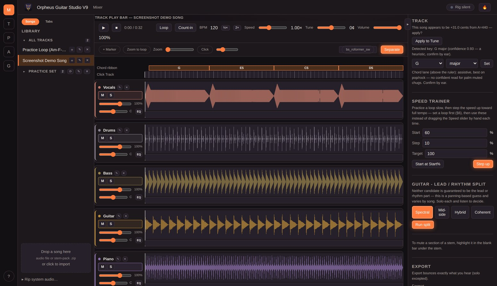
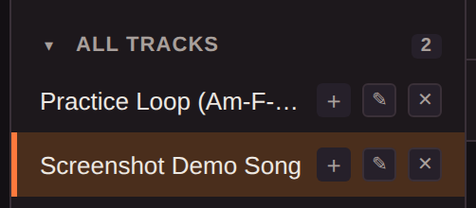
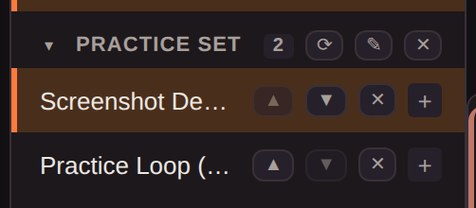
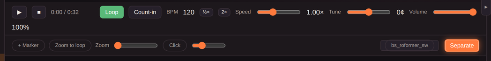
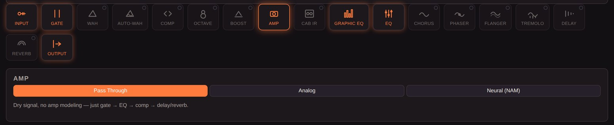
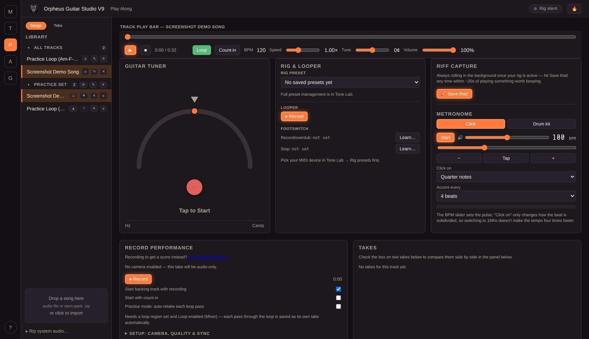
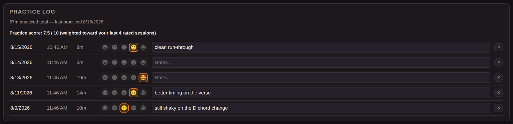

# Orpheus Guitar Studio — User Manual (v8)

Everything in this manual exists and works today — nothing here is
aspirational, and nothing below covers how the app used to work. An
in-app **❓ Help** button (sidebar) covers the same essentials for anyone
who won't read this file.

Orpheus Guitar Studio separates a song into stems (vocals/drums/bass/
guitar/piano/other), lets you build a custom backing track by muting/
fading whichever parts you don't want, and gives you a Play Along rig
(amp modeling, effects, cab simulation, a tuner, and performance
recording) to practice or record guitar over the result. Everything runs
locally in your browser, talking to a small Python server on your own
machine — nothing is uploaded anywhere.



**How this manual is organized:**

1. [Setup](#1-setup) — installing the app from scratch, for someone who's
   never used Terminal.
2. [First session checklist](#2-first-session-checklist) — the shortest
   path from a fresh install to your first backing track.
3. [The Mixer](#3-the-mixer) — import, separate, mix, loop, export.
4. [Tone Lab](#4-tone-lab) — build and save a guitar rig.
5. [Play Along](#5-play-along) — practice and record with that rig.
6. [AI Lab](#6-ai-lab) — scales/theory, Rate My Take scoring, and an
   opt-in AI Assistant.
7. [Tab View](#7-tab-view) — import and read Guitar Pro tabs, with a
   playhead cursor and section looping.
8. [Keyboard shortcuts](#8-keyboard-shortcuts)
9. [Troubleshooting](#9-troubleshooting)
10. [Known limitations](#10-known-limitations-by-design-not-oversights)
11. [File locations reference](#11-file-locations-reference)
12. [Appendix A: Control glossary](#appendix-a-control-glossary) — every
    button, slider, dropdown, and checkbox in the app, one or two
    sentences each — reference material, not meant to be read top to
    bottom.

[TEST-PLAN.md](TEST-PLAN.md) covers the same ground as this manual the
other way round — a regression checklist grouped by app area, for after a
change rather than for a first-time read.

---

## 1. Setup

**Before you start:** a Mac (Apple Silicon is faster for the song-splitting
step, but an Intel Mac works too), about **10GB of free disk space** (the
separation engine pulls down several GB of machine-learning libraries and
model files), and **20–30 minutes**, mostly spent waiting on downloads.
No coding experience needed — every step below is a command you copy and
paste into Terminal, one block at a time.

### 1.1 Open Terminal

Press `Cmd + Space`, type **Terminal**, press Enter. For each command
block below: click into the Terminal window, paste (`Cmd + V`), press
Enter, and wait for it to finish before moving to the next block. A
command that's still running usually shows no obvious sign of progress
for stretches at a time — that's normal, not a hang.

### 1.2 Install Homebrew (skip if you already have it)

Homebrew is the standard way to install developer tools on a Mac. Not
sure if you already have it? Type `brew --version` and press Enter — if
that prints a version number, skip to §1.3.

```bash
/bin/bash -c "$(curl -fsSL https://raw.githubusercontent.com/Homebrew/install/HEAD/install.sh)"
```

It'll ask for your Mac password at some point (typing it shows nothing on
screen — that's normal, not broken) and may print extra instructions at
the end about adding Homebrew to your PATH. If it does, copy-paste and
run whatever command it shows you before continuing.

### 1.3 Install the tools the app needs

```bash
brew install python@3.12 ffmpeg git
```

### 1.4 Download the app

This puts it on your Desktop — feel free to pick somewhere else.

```bash
cd ~/Desktop
git clone https://github.com/chillax7/Guitar-studio.git
cd Guitar-studio
```

### 1.5 One-time setup

```bash
python3.12 -m venv venv
source venv/bin/activate
pip install -r requirements.txt
```

That last command is the slow one — it's installing the actual
song-separation engine (a few GB) and can take 10–15 minutes.

### 1.6 Build the launcher and start the app

```bash
bash scripts/build_app.sh
```

This creates **Guitar Studio.app** inside the folder. Double-click it in
Finder to launch — from now on, that's the only thing you need to do to
open the app.

**First launch only:** macOS will block it because it isn't from the App
Store. Right-click the app → **Open** → **Open** again to confirm. (Or:
System Settings → Privacy & Security → scroll down → **Open Anyway**.)
You only have to do this once. Your browser should then open on its own
to the app.

**Starting it again later:** just double-click **Guitar Studio.app**.
None of the setup steps need repeating.

**Closing the tab/window quits the server too.** A few seconds after the
last browser tab or window showing the app closes, the server shuts itself
down on its own — no need to separately quit it from a terminal or Activity
Monitor. Merely **switching to another tab** or minimizing the window
doesn't count as closing it — the app keeps running in the background
exactly as before, so leaving it open while you do something else for a
while is fine. **Reloading the page** (⌘R) also doesn't quit it — the
few-second grace period is specifically there to survive a refresh.
**Note:** if you double-click **Guitar Studio.app** again while a server
from an earlier launch is still running (nothing has closed it yet), the
launcher just reopens the browser to that same still-running process
rather than starting a fresh one — this matters if you've just updated the
app itself, since the older process won't have your changes until it's
actually been shut down (close every tab/window to it, wait a few seconds,
then relaunch). Pass `--no-auto-shutdown` to `server.py` (see below) if
you'd rather it always run until you stop it by hand.

**Running it by hand instead** (e.g. to watch the server's own log while
it runs):

```bash
source venv/bin/activate
python3 GuitarStudio/server.py --port 8765
```

then open `http://127.0.0.1:8765/` yourself. The server only listens on
`127.0.0.1` (loopback) — nothing outside your Mac can reach it, and
nothing you do in the app is ever uploaded anywhere. Add `--no-auto-shutdown`
to keep it running after every tab/window closes, instead of the default
auto-shutdown behavior described above.

### 1.7 Optional: setting up Rip (system-audio capture)

The Rip feature (§3.2) captures whatever's playing on your Mac straight
into your Library, with no file needed at all. It's genuinely useful, but
it's the one part of setup that asks something of a non-technical user:
routing your Mac's audio through a virtual device. Full walkthrough below
— skip this section entirely if you always work from files you already
have; nothing else in the app needs it.

**What a "virtual audio device" is, in plain terms:** normally, sound
made by any app on your Mac goes straight to your speakers/headphones.
Ripping needs that sound to *also* go somewhere the browser can record
it from — a small piece of free software called BlackHole creates a
fake "audio output" that other apps can capture from, the same way a
real output device works, except nothing plays out of it on its own.

1. **Install BlackHole** (one-time):
   ```bash
   brew install blackhole-2ch
   ```
2. **Set your Mac to output through it.** Open **System Settings → Sound
   → Output**, and pick **BlackHole 2ch**. From this point until you
   switch it back, you'll hear silence from your Mac's speakers — that's
   expected (see step 3 for how to still hear things while ripping).
3. **(Recommended) Build a Multi-Output Device, so you can still hear
   audio while ripping:**
   - Open **Audio MIDI Setup** (press `Cmd + Space`, type it, Enter).
   - Click the **+** in the bottom-left corner → **Create Multi-Output
     Device**.
   - In the list on the right, check both **BlackHole 2ch** and your
     normal output (e.g. "MacBook Pro Speakers").
   - Go back to **System Settings → Sound → Output** and pick this new
     Multi-Output Device instead of plain BlackHole — now sound plays out
     of both your speakers *and* into BlackHole, where the app can
     capture it.
4. **In the app:** reload the page if it was already open. The **Rip
   system audio** card in the sidebar should now show BlackHole (or your
   Multi-Output Device) in its device dropdown instead of the "no
   BlackHole device found" message. See §3.2 for how to actually record.

**One thing worth knowing up front, so it doesn't feel broken later:**
hardware volume keys and the menu-bar volume slider often stop working
normally once BlackHole (or a Multi-Output Device containing it) is your
default output — that's a real limitation of virtual audio devices in
general, not a bug in this app or in BlackHole. The practical fix:
**switch your default output back to your normal speakers/headphones once
you're done ripping** (System Settings → Sound → Output, or the menu-bar
Sound icon if you've enabled it — Control Center → Sound → *Always Show
in Menu Bar*), and only switch to the Multi-Output Device again the next
time you actually want to rip something.

---

## 2. First session checklist

The fastest path from a fresh install to hearing your own backing track.
For a fuller, tickable version of this same walkthrough (progress saved
locally as you go, covering every screen in the app), open
[FIRST-SESSION-CHECKLIST.html](FIRST-SESSION-CHECKLIST.html) directly in
a browser — no server needed.

- [ ] Launch **Guitar Studio.app**; confirm the browser opens on its own
  to the Mixer.
- [ ] Import a song: drag an MP3/WAV onto the sidebar, or click the drop
  zone to pick a file (§3.1).
- [ ] Select it, pick a model (default `bs_roformer_sw` is a good first
  choice), click **Separate** (§3.4) — first run downloads model weights,
  so it's slower than every run after.
- [ ] Once stems load, try muting/soloing a couple of lanes and dragging
  a fader (§3.5).
- [ ] Set an A/B loop on a section you want to practice, turn on **Loop**
  (§3.6).
- [ ] Turn on **Click** and confirm it's audible and in time (§3.5).
- [ ] Notice the **Quest Log** in the right-hand panel before you've loaded a
  track — it's a running checklist of the moves above, ticking off on its
  own as you actually do them (§3.10).
- [ ] Export a mix (§3.9) and use **Reveal in Finder** to confirm the
  file is really there.
- [ ] Open **🎛 Tone Lab**, enable your input device (§4.1), pick an amp
  mode, play a note and confirm you hear it processed.
- [ ] Open **🎸 Play Along**, hit **● Record** for a few seconds, stop,
  and confirm the take appears under **Takes** (§5.5).
- [ ] If you plan to use Rip: complete §1.7's BlackHole setup once, then
  do a short test rip (§3.2).

---

## 3. The Mixer

### 3.1 Library & importing songs

The left sidebar's width is adjustable — drag the seam right where it
meets the canvas (cursor turns to ↔) to widen or narrow it, e.g. for
longer song/playlist names; double-click the seam to reset it back to
the default width. It's remembered across reloads.

The left sidebar lists your songs. **All Tracks** is its own collapsible
group (click the ▸/▾ arrow, or its name) and always shows every imported
song, regardless of playlist membership. Drag an audio file **or a stem-pack
`.zip`** (§3.3) onto the single **Drop an audio file or stem pack here** box
(dropping anywhere in the sidebar works, not just the box itself — it
highlights blue while you're dragging over the sidebar), or click it to pick
a file; the app routes by file extension automatically, so there's no
separate zip drop zone to find. Large files may take a moment to upload; the
drop box shows "Importing…" while that's in progress. **A file that reads
back with
fewer bytes than expected — most often a OneDrive/iCloud file that looks
present in Finder but hasn't actually been downloaded to this Mac yet —
is caught before upload and reported clearly**, with a suggestion to
right-click it in Finder and choose "Download Now" first.

Songs are listed without their file extension (an import named
`Empty Rooms - Gary Moore.mp3` reads as just "Empty Rooms - Gary Moore")
— display only; the underlying file keeps its real name and extension.

Click any song to select it. A brief **Loading…** state shows while its
stems are being fetched; what you see once that resolves depends on the
song's state:

- **Not separated yet:** you'll see a model picker and a **Separate**
  button (§3.4).
- **Already separated:** the mixer loads immediately, restoring whatever
  mix you last saved for it.
- **Source file changed since separation:** an amber banner offers
  **Re-separate** or **Dismiss** — nothing is ever silently thrown away.

**Renaming and deleting a song** — a ✎ and ✕ button sit next to each
track's name (next to its own **+** for adding it to a playlist, below).
Renaming only touches the source filename; separated stems, saved
mixes/practice history, and any recordings/exports for that song all
follow the rename automatically — nothing is orphaned. Deleting removes
the source file *and* everything derived from it (stems, exports,
recordings) after a confirmation, and drops the song from any playlists
that referenced it.



### 3.2 Rip — capture whatever's playing on your Mac

Don't have the file at all — just something playing in a browser tab,
another app, anywhere on your Mac? The **Rip system audio** card in the
sidebar — collapsed by default behind a disclosure triangle, since it's
the one Library card that needs one-time setup before it's useful; expand
it once and it stays expanded on later visits — captures it straight into
your Library as a new song. This needs
the one-time BlackHole setup in §1.7. Once that's done: pick your
BlackHole/Multi-Output device in the dropdown, click **● Start Rip**, and
the elapsed time counts up while it records; click **■ Stop Rip**, give
the take a name, and it appears in your Library like any other imported
song.

If the routing isn't actually set up right (BlackHole not selected as
your Mac's output, or nothing was actually playing), a rip can finish
"successfully" while capturing total silence — the recording itself
doesn't fail, it just has nothing in it. Rather than letting that surface
minutes later as a confusing "no stems found" error the first time you
try to separate it, saving a rip checks its loudness immediately: if it
measures suspiciously close to silent, you'll get a warning right away
naming the measured level and pointing at the BlackHole/Multi-Output
Device fix (§1.7), while the routing mistake is still fresh in mind. The
file is saved either way — a genuinely quiet recording isn't discarded on
a guess — so if you get this warning and you're sure the audio was really
there, it's still in your Library to check.

### 3.3 Importing a stem pack (.zip)

Already have a song split into its parts — a purchased "custom backing
track" pack, a friend's multitrack export, anything pre-split? Skip
separation entirely: click **Drop a stem pack (.zip) file here** (the
box just below the normal drop zone, with the same dashed-border/lighter
fill as the audio drop zone above it — dropping a `.zip` directly onto
the sidebar is auto-detected and routed here too, whichever box it lands
on). Every audio file inside becomes its own stem lane, named exactly as
the file was — long names wrap in the lane header rather than getting
cut off, and each stem's on-screen name can also be renamed independently
(§3.5) without touching the underlying file. The track appears in your
Library immediately, with its own autosaved project and practice log
entry, exactly like any other song. Each stem is converted to WAV on
import but never run through separation — that's the whole point. BPM,
beat grid, chord lane, and key detection all still work on an imported
pack, matching stems by name (anything that looks like a guitar/bass/
piano/drum part) rather than needing the fixed stem names a separation
model produces. If two files in the zip would collide to the same stem
name, the import fails up front with a clear message naming both, rather
than silently overwriting one.

**Marking a stem as the guitar.** Tone Lab's Suggest a tone, Rate My
Take, and Practice Tips all need one real audio file they can point at as
"the guitar" — a separated track always has one (a stem literally named
`guitar`), but an imported pack's stems keep whatever names the source
files had, so none of them will ever match automatically. A small **🎸**
button next to each stem's **✎** rename button (imported packs only) lets
you designate whichever stem is actually the guitar part; the marked
stem lights up, and Suggest a tone/Rate My Take/Practice Tips immediately
start treating it exactly like a real separated guitar stem. Only one
stem can be marked at a time — marking a different one un-marks the
previous choice — and it's remembered for that song like everything
else, surviving a reload.

### 3.4 Playlists / setlists

A playlist is its own collapsible group in the same tree as All Tracks,
right there in the Library — no separate playlist picker or management
screen. Create one from any song's own row: click the **+**, then **+ New
playlist…**, give it a name, and it appears alphabetically below All
Tracks with that song already in it. **A song can belong to any number of
playlists at once, and always still shows under All Tracks too** — adding
it to a playlist is never a move, only an extra listing. Add a song to
more playlists the same way: click its **+**, tick whichever playlist(s)
you want — the popover closes as soon as you tick one.

Each playlist's header carries a deliberately small set of controls:
- **⟳ (Auto-play)** — arms this playlist to play itself: when a song from
  it finishes naturally, the next song in the playlist loads and starts
  on its own, straight through to the end of the set (no wraparound —
  after the last song, playback stops for real). The button shows green
  while armed; only one playlist can be armed at a time, the choice
  survives a reload, and a song that still needs separating stops the
  chain there (loaded, waiting for you) rather than skipping it.
- **✎ / ✕** — rename or delete the playlist (the songs themselves are
  untouched either way).

Inside an expanded playlist, each song row has **▲ / ▼** to reorder it
and **✕** to remove it from just that playlist (never deletes the song).
Clicking any song, in any group, loads it exactly the same way — a
playlist is only ever an ordering, never a copy of a song's mix/rig
settings.



### 3.5 Separating into stems

A track imported as a stem pack (§3.3) skips this section entirely —
its model badge just reads `imported`, and the mixer is ready the moment
you select it. Everything below is for a normal single-file import.

Pick a model, then **Separate** (styled the same blue as Export — it's the
main action once you've picked a model). This runs entirely on your Mac
(no internet needed after the model weights are cached) and typically
takes somewhere around a quarter to a fifth of the song's length. A
progress bar shows separation is actively progressing — it isn't a
countdown/time estimate, just a heartbeat that something is happening;
watch that 99% doesn't fool you into thinking it's about to finish, since
the last stretch of some models' internal passes can sit there a while.

| Model | Stems | Notes |
|---|---|---|
| `bs_roformer_sw` | vocals, drums, bass, guitar, piano, other | **Default.** Notably better guitar-stem quality than the Demucs models |
| `htdemucs` | vocals, drums, bass, other | Fast, no guitar stem |
| `htdemucs_ft` | same | Slower, slightly cleaner |
| `htdemucs_6s` | + guitar, piano | Also guitar-capable, if you want to A/B against `bs_roformer_sw` |
| `mdx` / `mdx_extra` | vocals, drums, bass, other | Alternative engine |

You can **A/B two models on the same song**: click the model badge in the
toolbar to switch — if that model hasn't been run yet, you'll be prompted
to separate with it too. Nothing is overwritten; both live side by side.

**A separation that reports "failed to fetch" may have actually
finished.** A very long separation holds one connection open for
minutes with no data on it until the very end, which some networks/VPNs/
firewalls treat as "idle" and quietly kill even though the job is still
running server-side. If that happens, the app checks the job's real
status before giving up — if it actually finished, your stems load
normally with no error at all; you'll only ever see a failure message for
a separation that genuinely didn't complete.

**Honest limitation:** even with every stem at full volume and nothing
muted, the recombined mix has a mild "processed" character — that's the
separation engine's quality ceiling, not a bug in your mix.

### 3.6 The Mixer's controls

Each stem is a lane: name (with a small **✎** to rename its display
label — useful for a stem pack import with a long original filename;
this only changes what's shown, never the underlying file or your saved
gain/mute/pan settings for it) and a small **✕** to remove the stem
outright (with a confirmation first) — **every** stem can be removed this
way now, not just a custom one: a model-produced stem (vocals/drums/
bass/guitar/piano/other) or a derived one (§3.8's split candidates) too,
useful for clearing out a stem you know you'll never use for this song.
Removing one of these isn't as permanent as removing a custom stem —
**Re-separate** (§3.5, with force) regenerates everything the model
produces, custom stems included in that they're untouched by it either
way — but there's no "are you sure" beyond the one confirmation, so treat
it the same as any other delete. **M**(ute)/**S**(olo) buttons (soloing a
lane that's currently muted un-mutes it too — the point of Solo is to
hear that one stem, so a muted one wouldn't otherwise make a sound even
while soloed; un-soloing afterward leaves it unmuted rather than
silently re-muting it), a gain
fader (double-click its percentage to reset to 100%; split-guitar
candidate stems — §3.8 — get extra headroom, up to 300% instead of 150%,
since a panning-based split often leaves one side quiet), a **Pan**
slider (double-click its label to recenter), an **EQ** disclosure
(3-band: bass/mid/treble, ±12dB), and its waveform. **Solo, Pan, and EQ
are all *monitoring* conveniences only — none of them affect what gets
exported (§3.9)**; they're there to help you carve space to play along
(pan the drums off-center, cut some bass mud while you practice), not to
change the mix your export produces.

Playback controls split across two rows. The **top toolbar** (left of the
model badge and Separate button) holds the timeline tools: **Loop**,
**+ Marker**, **Zoom to loop / Zoom out**, a continuous **Zoom** slider,
**Click** plus its own volume slider, and **Count-in**. **Loop, Zoom to
loop/Zoom out, Click, and Count-in all light up solid green while their
state is actually active** (Zoom to loop swaps to a green "Zoom out"
button for as long as the zoomed-to-loop view is showing); every other
button in the toolbar is the app's normal solid blue. The **transport
bar** below it has the playback essentials:

- **Play / Pause / Stop** and the current position. Switching to a
  different song always resets the icon back to ▶, even if the previous
  song was mid-playback when you switched.
- **BPM** — the detected tempo, rounded to the nearest whole number,
  scaling live with the Speed slider. Automatic tempo detection
  occasionally locks onto exactly half or double the real tempo (a
  well-known limitation of tempo estimation, not specific to any one
  song) — the small **½×**/**2×** buttons beside it correct this in one
  click and the fix is remembered for that song from then on.
- **Speed** (0.5×–2×) — changes playback rate while keeping pitch the
  same. Double-click the ×-value to reset to 1.00×.
- **Tune** (±1200 cents = ±1 octave) — shifts pitch independently, at
  the same speed. Fine corrections handle a record that's slightly off
  concert pitch (±100¢ ≈ ±1 semitone); the full-octave range makes it a
  transpose control for playing a song in an easier key. Double-click the
  ¢-value to reset to 0. The inspector panel shows a **detected key** (a
  heuristic — confirm by ear) and, once you move Tune off zero, what key
  that transposition actually lands you in (e.g. "Transposed +2
  semitones → A major"). Once the chord lane (§3.7) has confident chords,
  the key reading is based on those rather than raw pitch-content
  correlation — noticeably more reliable on blues/rock, where a lot of
  dominant-7 chords can otherwise fool a plain major/minor match. The
  tonic is whichever root shows up on the most beats overall (in practice
  usually the actual tonic); major/minor is then judged from the actual
  minor-3rd vs. major-3rd note content at that root, not from a single
  chord's own quality label — power chords (just root + 5th, no 3rd at
  all) can't tell a maj/min template apart on note content alone, so
  trusting one chord's label there was silently biasing riff-heavy rock
  and metal songs toward false "major" reads.
- **Correcting a wrong key** — key detection is still just a heuristic,
  and it can occasionally favor a related key over the one you'd actually
  call the song by ear (a song that leans on a borrowed chord can tip a
  global chroma match toward a neighboring key). Unlike the BPM ½×/2×
  fix, there's no simple formula from "wrong key" to "right key", so
  below the key reading there's a **root note + major/minor** picker and
  a **Set** button — pick the real key and click Set. A **Reset** button
  appears once you've done this, in case you want to go back to whatever
  was actually detected. The correction is remembered for that song from
  then on, and AI Lab's Scales tab (§6.1) picks it up immediately too —
  "Whole song" scale suggestions and the per-chord "Song key" readout both
  follow the corrected key, not the original detection, whether AI Lab is
  already open or you open it afterward.
- **Volume** — an overall listening-level slider for the backing track.

And the two toolbar click features:

- **Count-in** — when on, playback (and recording — §5.2) starts after 2
  bars of click, synced to the track's detected BPM.
- **Click** — a metronome click synced to the actual detected beat grid
  (not just an assumed manual BPM, like the count-in). Every 4th beat is
  accented as a downbeat (an assumed 4/4 — there's no time-signature
  detection). Its own volume slider sits right next to it (goes twice as
  loud at full as it used to, for cutting through a busy full-band mix —
  the slider's starting position still gives you the same volume as
  before, only the ceiling moved). Driven from the same per-frame
  position poll the playhead uses rather than pre-scheduled, so it
  tracks Speed and Tune automatically, at the honest cost of a few ms of
  animation-frame jitter versus a real hardware click. If Click is grayed
  out, the track has no beat grid yet — this is analyzed automatically
  when a track is (re)selected, so simply reselecting it turns Click on.

Speed and Tune reset to neutral whenever you switch tracks — a leftover
half-speed setting silently carrying over to a new song would be a trap,
not a feature. **Volume does not reset** on track switch — it's your
listening level, not something that belongs to any one song.



### 3.6a Adding a custom stem

Drag an MP3 or WAV onto the mixer's lane area (anywhere over the
waveforms/ruler, not the sidebar — a dashed overlay reading "Drop to add
as a new stem" confirms you're over the right spot) and it appears as one
more stem, tagged **custom** in its lane header. From that point on it
behaves exactly like every other stem: mute, solo, fader, pan, EQ, mute-
painting, and export all just work, no different treatment needed. Use
it for anything the separation model can't isolate well, or doesn't
produce at all — your own recorded guitar take played over the mix,
a purchased single-instrument backing track, a reference click track.

This needs a track that's **already separated** — drop before that and
you'll be told to separate first, since there's no stem lane to add
alongside yet. A custom stem is remembered for the song itself, not for
whichever separation model happens to be selected — switch between
`htdemucs_6s` and `bs_roformer_sw` to A/B them and it stays put in both,
and re-separating (even with **Re-separate**) never touches it. Dragging
in a new file with the same name replaces the old one, for re-recording
an improved take without any extra cleanup step. A small **✕** next to a
custom stem's name removes it for good (with a confirmation first) —
the same ✕ every other stem's lane has too (§3.6), but for a custom one
there's no Re-separate to bring it back afterward.

**Positioning a custom stem in the song ("patching"):** a custom stem
doesn't have to start at the beginning — drag its waveform left or right
(cursor turns to ↔ over it) and it slides to wherever you drop it,
leaving blank space before/after the clip in its lane. Useful for
dropping in a short re-recorded piece — just the solo, a fixed verse —
and lining it up with the rest of an already-separated track instead of
re-recording the whole thing. A plain click on a custom stem's waveform
still seeks like any other lane; only an actual drag repositions it.
Export bounces it at wherever you've dropped it, same as what you hear
live. **One current limitation:** repositioning only plays back correctly
with Speed and Tune at their defaults (1.00×/0¢) — with either one moved,
a repositioned custom stem plays from the wrong spot until they're back
to normal.

### 3.7 Timeline, looping, and the chord lane

**Chord ribbon and Click Track stay pinned to the top of the workspace**
as you scroll down through a song with many stems — they never scroll
out of view the way the stem lanes below them do.

Tall waveforms with a paintable mute lane under each stem sit directly
below the transport — click-drag to mute just a section (e.g. a guitar
solo), click an existing region to remove it. This uses exactly the same
`(stem, start, end)` data the export engine does, so what you paint is
exactly what gets exported.

**A/B loop:** drag the two handles on the ruler above the lanes to set a
loop region; the **Loop** button in the toolbar toggles it on/off
(defaults to the whole track the first time you enable it). Click anywhere
on the ruler (not on a handle) to seek. Hold **Alt** while pressing **←/→**
for a finer 100ms nudge (Shift is still the coarse 5s jump) — useful for
lining a loop/mute edge up to an exact transient.

**Waveform zoom:** with a loop set, click **Zoom to loop** in
the toolbar to rescale the ruler and every lane's waveform to fill the
view with just that region — real added detail, not the same picture
stretched, since the waveform re-renders from the source audio at the new
resolution. Everything stays consistent while zoomed: ruler clicks, loop-
handle drags, and mute-region painting all map to time correctly within
the zoomed range; markers/beat-grid ticks outside it simply don't draw.
**Zoom out** returns to the whole track. Zoom is a per-session view aid,
like Speed/Tune — it resets when you switch tracks.

**Continuous zoom:** the **Zoom** slider next to Zoom to loop/Zoom out
works independently of them — instead of narrowing the time range shown
(what Zoom to loop does), it widens the ruler/waveforms/chord lane beyond
the window, scrolling horizontally, up to 24× the fit-to-window size.
Stem names and the Chord ribbon/Click Track row labels stay fixed on the
left as you scroll, same idea as a DAW's frozen track headers. During
playback, the view follows the playhead once it crosses the middle of the
window (GarageBand-style) — it doesn't scroll before then, and it snaps
straight to center on a big jump (a loop wrap, a marker double-click, a
manual seek), rather than leaving the playhead stranded off-screen. The
two zoom controls combine: zoom to a loop first, then drag the slider to
zoom in further within just that region. Double-click the slider to reset
to fit-width. Also a per-session view aid — resets on track switch, same
as Zoom to loop.

**Section markers:** click **+ Marker** in the toolbar to drop a
named marker at the current playhead position (you'll be asked to name
it — "Solo", "Chorus 2", whatever helps). Markers appear as small tags in
a strip above the ruler:
- **Click** a marker to jump the playhead there.
- **Double-click** a marker to loop from it to the *next* marker (or the
  end of the track, if it's the last one) — turns Loop on automatically.
  This is the fast way to isolate a solo: drop a marker where it starts,
  another where it ends, double-click the first.
- Hover a marker to reveal a small **×** to delete it.

Markers are saved per-song, same as everything else in this section.

**Chord lane:** a row of chord chips above the ruler, labeled "Chord
ribbon" (only appears once chord analysis exists — it's computed
automatically alongside BPM/beats/key, so older tracks pick it up the
next time they're selected). Each chip spans one beat-grid interval;
click one to jump the playhead there. This is a **maj/min/7/5-only
heuristic** — beat-synchronous chroma matched against simple chord
templates, not a real chord-recognition model — assistive and best on
pop/rock, same honesty framing as §3.8's guitar split. Chord changes are
smoothed across beats rather than picked one beat at a time, so an
ordinary riff or chug reads as one steady chord instead of flickering
between neighboring guesses; a bare power chord (root+fifth, no third —
most distorted rhythm-guitar parts) reads as e.g. **A5** rather than
being forced into major or minor. On the other end — simple acoustic
songs — an honest major or minor open chord now reads as plain **A** or
**Am** and isn't dragged to a power chord or a dominant **A7** by the
bass sitting underneath it (the bass's root and its overtones used to
mask the guitar's third and fake a flat-seventh; the quality decision now
ignores the bass and listens to the chord instruments themselves). The
chord ribbon also no longer needs a drum track to exist — a fingerpicked
or drumless song still gets a beat grid (tracked from the guitar/piano
onsets instead) and a full chord lane, where before it showed nothing. A
dimmed **?**
chip means no confident read for that beat rather than a guess; zoom in
(above) to actually read the chord names, since a whole song's worth of
chips at full width just reads as a solid bar. Chord roots transpose live
with the Tune slider, same as the Detected Key hint. **Known rough edges:**
on riff-heavy songs, the ribbon can read as busier than the underlying
harmony actually is (individual moving notes flipping the per-beat
read rather than the rhythm part changing chord) — judge by ear, and
treat a wall of rapidly-alternating chips as "this section is
riff-based," not as literal chord-by-chord accuracy. And a song built over
a **constant droning note** (a sitar or bagpipe holding the tonic under
everything) can read as one held power chord — the drone floods every beat
with the same root+fifth and drowns out the chords moving over it; this is
a known limitation, not something to file per-song.

**Speed Trainer:** in the right-hand inspector — set a loop first
(a marker double-click is the fastest way), then use **Start** / **Step
up** instead of dragging the Speed slider by hand between passes. Start
jumps to a reduced practice speed (default 60%); each **Step up** click
nudges Speed toward Target (default 100%) by Step (default 10 points),
clamping exactly at Target on the last click rather than overshooting.
Practice a hard passage slow, then step it up toward full tempo one clean
pass at a time.

### 3.8 Guitar split (experimental)

Only available once a stem literally named `guitar` exists (i.e. you
separated with a 6-stem-capable model). Opens from the **Guitar - Lead /
Rhythm Split** section in the right-hand inspector once a guitar stem is
loaded.

This is a **stereo-panning heuristic**, not a real lead/rhythm separation
model — no such model exists anywhere as an open weight. The two results
are always labeled **Candidate A (center)** and **Candidate B (sides)** —
never "Lead"/"Rhythm" — because which one is actually which varies by
song and sometimes neither is clean. Solo each and judge by ear. The
correlation number shown is diagnostic only; it does not reliably predict
whether the split will sound good.

Four split algorithms are offered:

- **Spectral** (default) — adapts the center/sides split per frequency
  bin, usually the best starting point.
- **Mid-side** — the blunt whole-track version: one fixed 50/50 split
  applied everywhere. Rarely beats Spectral, kept mainly for comparison.
- **Hybrid** — Spectral, sharpened using how tightly the guitar's note
  onsets line up with the song's detected beat grid. Still not a
  lead/rhythm classifier — it's a confidence tweak on top of the same
  panning read, on the theory that strummed/chordal playing sits at a
  more decisively fixed stereo position than a lead line wandering under
  bends and vibrato. Needs a detected beat grid to do anything (falls
  back to plain Spectral without one — instrumental-only tracks or ones
  where tempo detection failed won't see a difference from Spectral).
- **Coherent** — for the case where Spectral's Candidate A (center) is
  already close to a clean lead-only proxy but Candidate B (sides) still
  has strong lead bleed in it. Instead of guessing from panning alone, it
  cancels Spectral's center estimate directly out of the original left/
  right channels using a phase-coherent match, so only the content that's
  actually explained by the lead gets removed rather than anything merely
  as loud as it. Worth trying whenever Candidate B on another method
  still sounds like it has the lead mixed in under the rhythm part.

None of the four is guaranteed to beat the others on a given song —
try more than one and judge by ear, same as always.

Both Candidate A and Candidate B are peak-normalized against the original
guitar stem's own peak level when the split runs, so neither one comes out
needing an extreme gain boost just because the source happened to be only
lightly panned rather than hard stereo-spread (real user report: the
"sides" candidate on one song was audible but far too quiet even boosted
to the mixer's already-elevated 300% cap for split stems — this is why).

### 3.9 Export

The **Export** section is always visible in the right-hand inspector once a
track's stems are loaded — no separate button to click to reveal it.
**Export bounces exactly what you hear** (except solo, which is
monitoring-only). Options:

- **Format:** WAV or MP3.
- **Output name** — the field's placeholder text (`e.g.
  backing_track.wav`) is just an example, not a default that's already
  filled in; leave it blank and the app names the file for you.
- **Target LUFS** (default −14).
- **Normalize loudness** — on by default; turn off to skip loudness
  correction entirely.
- **Max boost cap** (default +10 dB) — quiet/solo mixes can need a large
  corrective boost to hit the target loudness, which makes separation
  artifacts more audible. The cap limits how far that boost goes; you'll
  see a note if it was hit and the target wasn't fully reached.
- A peak-safety clamp (to about −0.2 dBFS) is automatic, not adjustable —
  it only fires as a last resort if normalization would otherwise clip.

Exported files land in `output/<song name>/`, alongside a model-prefixed
copy of every stem you've separated for that song. After a successful
export you get a **Reveal in Finder** shortcut straight to it — and the
file also shows up immediately in Play Along's **Exported Tracks** card
(§5.9) if that screen is open.

### 3.10 Top banner: rig status, theme, and the Quest Log

The top banner is the same on every screen and carries three things beyond
the app name and current-screen label:

- **Rig status pill** — a small, always-visible indicator of whether Tone
  Lab's input is enabled, actively receiving signal, or clipping, plus a
  latency figure (same "browser-reported, output-side only, not a true
  round-trip measurement" honesty as §4.8's own latency note — this pill
  doesn't measure anything the app couldn't already tell you, it just
  surfaces it without having to open Tone Lab first). Gray/neutral before
  input is enabled; pulses gently while live (this pulse respects your OS's
  reduce-motion setting); switches to a clipped state matching Tone Lab's
  own clip light. Click it to jump straight to Tone Lab.
- **Theme toggle** — cycles through five looks: **Molten Obsidian** 🔥
  (the default dark-ember palette), **Bright Spark** ☀️ (a bright,
  light-mode-style palette, same spark-gold accent identity), **Studio**
  🌙 (the original quieter neutral palette), **Future Metal** ⚙️ (a cool
  steel/industrial palette), and **Castle Rock** 🏰 (a warm stone
  palette). The button's icon always shows the *current* theme; click it
  to advance to the next one. Purely cosmetic — nothing about how any
  feature behaves changes, only the color scheme (and, in one place,
  which guitar body shows on the global busy overlay while something's
  processing: a Les Paul for Studio, a Strat for Bright Spark, an SG for
  Molten Obsidian, a Flying V for Future Metal, and a lute-style acoustic
  for Castle Rock). Your choice is remembered across reloads with no
  flash of the wrong theme while the page loads. Every themed surface
  reskins together, including the chord ribbon (Mixer and AI Lab's Scales
  tab both use the same color as that song's stem waveforms, so chord
  analysis reads as belonging to the audio it describes) and the stem
  waveforms themselves.
- **Quest Log** — before you've loaded any track, the right-hand inspector
  panel (where the mixer's usual per-track panels normally live) shows a
  first-use checklist instead: separate a song, mix it, dial in a tone,
  capture a take, judge it with Rate My Take, ask the AI Assistant
  something. Each row shows done/not-done and a button that jumps straight
  to wherever that quest happens; it updates the moment you actually do the
  thing (not just when you visit the right screen), and is remembered
  across sessions. It's also reachable any time as a popup from the
  **❓ Help** panel, in case you want to check your progress without
  clearing your current track. Loading any track swaps the panel back to
  the normal per-track inspector views.
- **Collapsible inspector** — the small ▸/◂ tab sitting right on the seam
  between the lanes and the right-hand inspector (Track/Speed Trainer/
  Export, or the Quest Log before a track's loaded) collapses that whole
  panel to free up width for the lanes, and expands it back. Remembered
  across reloads.

---

## 4. Tone Lab

The rig lives across two screens, plus the mixer you started in and
Help — four equally-reachable buttons in the top-left of the sidebar
(**🎚 Mixer**, **🎛 Tone Lab**, **🎸 Play Along**, **❓ Help**). Both rig
screens share the exact same audio engine as the mixer (not a second,
separate audio session) — backing-track playback and your live guitar mix
together naturally, with no added round-trip latency from the recording
or mixing side. The split is by *task*, not by feature: **Tone Lab** is
where you build/tweak the sound (input, amp, cab, all 12 pedal cards, rig
presets); **Play Along** (§5) is where you practice and record with a rig
you've already dialed in. Selecting a track in the Library always drops
you back to the Mixer, closing whichever of the two rig screens was open.

Tone Lab's rig is a row of small icon chips — Gate, Amp, then every pedal,
then Output — in left-to-right signal order, wrapping to a second row if
your window's narrow. Click an icon to open its controls in the panel
below; only one panel is open at a time, so you're never scrolling past
fourteen other cards to find the one you want. An icon lights up (blue)
when its stage is active and dims when bypassed — a glance at the row
tells you what's actually in the signal path before you open anything.
The icon row's own left-to-right order **is** the signal-chain order, so
there's no separate diagram to keep in sync with it. Switching which
icon's panel is open (or switching Amp mode between Pass Through/Analog/
Neural) never moves your scroll position on its own — wherever you'd
scrolled to stays exactly there. The one exception is unavoidable: if the
newly-opened panel is shorter than the one you were looking at, and your
scroll position no longer exists in the new, shorter page, the browser
clamps it to the nearest valid spot — the same way any web page behaves
when its content shrinks.



### 4.1 Input

The input meter, clip light, and a **Setup: device & calibration**
disclosure sit in Tone Lab's top strip. Expand **Setup**, pick your audio
interface/microphone, and click **Enable input** — the browser will ask
for microphone permission once. "Enable Input" prefers a remembered
device (whichever you used last time) or, failing that, any input that
doesn't look like a built-in microphone — a Mac's built-in mic monitored
through speakers into an amp/distortion chain is a feedback loop, so
guessing an external interface first matters. Switching the device
dropdown while already enabled re-enables input on the new device
automatically. The Setup disclosure stays open once expanded — collapse
it yourself if you want the space back. The meter shows input level with
too-cold/good/too-hot zones; a **clip** light latches on if a transient
clips (it doesn't self-clear — click **Clear**, or start a new input
session, once you've noted it and fixed your gain staging). **Calibrate
(play your loudest chord)**, inside Setup, listens for 3 seconds and
suggests an output trim so your loudest playing lands safely below
clipping.

**Measure round-trip latency** (also inside Setup) is a real
measurement, not the estimate below it (§4.8) — it plays a short click
out and listens for it coming back in, timing the actual round trip.
This needs a physical loop: your interface's own direct-out connected
to its direct-in, or its hardware direct-monitor path engaged — it's
measuring that specific path, not the acoustic path through the room
(speaker to mic), so don't run it expecting to measure open-air latency.
If nothing comes back within a second, it says so plainly ("No loopback
detected...") rather than reporting a meaningless number.

### 4.2 Amp — three modes

- **Pass Through:** dry signal, no coloration — just gate → EQ → comp → delay/reverb.
- **Analog:** a drive stage (soft-clip waveshaper) plus a 3-band tone
  stack (bass/mid/treble).
- **Neural (NAM):** loads a `.nam` neural amp capture and runs real-time
  inference — see §4.6 for where to get models, §4.2a for the Tweaker
  controls, and §4.9 for a note on which captures can and can't run live.

### 4.2a The NAM Tweaker

A standard `.nam` capture is a snapshot of one amp at one knob setting —
there's no gain/presence/bass/treble hiding inside the file to expose, the
knobs were frozen in when it was trained. The Neural mode panel builds a
tone-shaping surface *around* the capture instead, the same way NAM's own
plugin does:

- **Metadata** — whatever the loaded `.nam` file's own metadata actually
  carries (real captures usually carry little to none of it — this is
  shown honestly, not padded out), plus what this app itself knows:
  architecture, the realtime-cost estimate from the speed probe, whether
  loudness metadata drove auto-calibration, and an ESR pulled from the
  filename if one's embedded there.
- **Drive** (-24 to +48 dB) — the closest thing to a real "gain knob" a
  frozen capture allows: it's how hard you push the captured amp, like a
  boost pedal in front — genuinely changes the distortion character.
- **Bass / Mid / Treble / Presence** — a dedicated post-amp tone stack
  *inside* the amp block, before Cab IR, separate from the EQ card further
  down the chain. Presence is a high-shelf tilt around 6kHz. Flat (0dB) by
  default — today's sound is unaffected until you reach for these.
- **Output level** — paired with an **auto-level** readout showing the
  calibration gain a capture without loudness metadata gets, measured
  against a test tone. The slider adds on top of that calibrated number.
- **Parametric captures** — a rare "A2"/slimmable NAM family has real
  conditioning knobs; this app's engine only supports the standard
  (ordinary shared-capture) architecture. Loading one of these shows an
  honest "not yet supported" message instead of a confusing generic
  failure or silently misreading the weights.

### 4.3 Rig presets, per-song chains, and the cycle key

The **Rig Presets** card (above the pedalboard, on Tone Lab) saves the
*entire* rig — amp mode, NAM capture + Tweaker knobs (or Analog's tone
stack), Cab IR, EQ, Compressor, Delay/Reverb, all the pedals, and Output
level — as a named preset. Presets are shared across every song (stored
server-side, not per-track): pick one from the dropdown and **Load** it
any time you just want to try a tone.

**This song's chain** (below the Save/Load controls) is where a song gets
its *own* ordered list of presets — e.g. **Clean**, **Rhythm**, **Lead**
for one tune — instead of just a single attached preset. Pick a preset in
the dropdown above and click **+ Add to this song's chain** to append it;
drag a chain row up or down to reorder it, or click **✕** to remove it.
Clicking any row in the chain jumps straight to it, live. The active entry
is highlighted so a glance at Tone Lab tells you which one is playing.

**Cycle forward / Cycle backward** step through this song's chain,
wrapping around at either end — **→** (right arrow) advances, **←** (left
arrow) goes back, by default. Click **Change…** next to either one and
press whatever key you'd rather use for it — each direction is remembered
per song, right alongside the chain itself. These only do anything while
Tone Lab or Play Along is open (both screens share the same live rig); the
Mixer's own left/right nudge shortcut deliberately steps aside while
either rig screen is open, so the two never fight over the same keypress.
Switching presets this way — cycling or clicking a chain row — fades the
output down and back up in ~20ms around the swap so the parameter jump
underneath never reaches the speaker as a click; if the new preset loads a
different NAM capture or IR, the fade stays down for however long that
takes to load, which can be longer than 20ms on a slower switch.

**MIDI footswitch (optional)** does the same forward/backward cycling as
the keyboard keys above, from a connected MIDI footswitch instead —
useful mid-song when your hands are both on the guitar. Pick your device
from the dropdown (the browser will ask for MIDI permission once — Chrome
or Edge; Safari doesn't support Web MIDI as of this writing), click
**Learn…** next to Cycle forward or Cycle backward, then press the
footswitch button you want mapped to it. Unlike the chain and keyboard
keys, this mapping is global, not per-song — a physical pedal's button
layout doesn't change from one song to the next. **First-build note:**
this was built and verified with simulated MIDI messages, but not yet
against a real footswitch — if something behaves oddly with your specific
hardware, that's genuinely useful to report, not a known-working feature
being mis-described.

Play Along carries a lighter **Rig Preset** picker in its own top strip —
just a dropdown, no Save/Delete/chain controls, for a one-off load of any
preset without leaving the practice screen (this doesn't touch the song's
chain — use the cycle keys or Tone Lab's chain list for that). Picking a
name there applies it immediately; both dropdowns always show the same
selection.

### 4.4 Cab IR

Loads a cabinet impulse response (`.wav`) via convolution. Simple on/off —
if your NAM capture already includes cabinet coloration (many do — often
labeled "full rig" or "combo" on TONE3000/ToneHunt), leave this off to
avoid doubling up. Picking an IR automatically turns bypass off, so you
actually hear it. Each IR is peak-normalized on load so a quiet/
unnormalized file doesn't cut your overall volume — loudness should stay
roughly consistent switching between different IRs.

**If a NAM capture sounds artificial, fizzy, or harsh, check this card
first.** A capture of just the amp head/preamp (no cabinet in the signal
path — the far more common kind, since it's what most captures are built
from for exactly this reason: pair it with whichever cab you want) still
has the full, unfiltered 20Hz–20kHz distortion spectrum a real guitar
speaker would never actually produce — a real 12" guitar speaker rolls
off hard above roughly 5-6kHz, and that rolled-off top end is most of
what makes a distorted amp sound like an amp instead of a swarm of angry
bees. If Cab IR is bypassed (its default state) and the capture is an
amp-only one, that's almost always the entire "fizzy" complaint — turn it
on and load a matching cab before concluding a capture itself is bad.

**Tone shaper:** a low-cut and high-cut filter on the loaded IR's wet
signal only (the dry bypass path is never touched), for trimming a cab
sim's extreme top/bottom independently of the general EQ card further down
the chain — e.g. cutting sub-bass rumble a real mic'd cab wouldn't
reproduce, or taming fizz above where a guitar speaker rolls off. Wide
open (no-op) by default; "Tone shape bypass" turns it off entirely without
losing your slider positions.

### 4.5 The pedalboard: EQ, Compressor, Delay/Reverb, Output, and more

A standard post-amp chain — 3-band EQ, a compressor (threshold/ratio),
delay (time/feedback/mix), and reverb (size/mix), each independently
bypassable — plus eight further pedal cards, then a final output level
with a meter:

- **Boost/Overdrive** — Drive + Level, a gain-staged waveshaper (the same
  distortion curve the Analog amp uses), true hard bypass.
- **Graphic EQ** — 5 bands (100Hz/300Hz/1kHz/3kHz/8kHz), ±12dB each,
  distinct from the 3-band EQ card.
- **Chorus**, **Flanger** — modulated short delays (Rate/Depth/Mix, plus
  Feedback on the Flanger for its resonant edge).
- **Phaser** — a 4-stage sweep (Rate/Depth/Mix).
- **Tremolo** — amplitude modulation (Rate/Depth), no dry/wet mix since
  there's nothing to blend. Depth genuinely reaches full chop-to-silence
  at 100% (a real hardware tremolo's own "depth" knob does the same) —
  low settings stay subtle on purpose, so dial it up if you want it more
  dramatic.
- **Auto-Wah** — an LFO-swept bandpass (Rate/Depth/Center/Mix). Named
  "Auto-Wah," not "Wah," on purpose: this sweeps on its own timer, it
  doesn't track an expression pedal — there's no MIDI/expression input
  wired up yet. Mix is a real dry/wet crossfade here (unlike Chorus/
  Flanger/Phaser, where the dry signal deliberately always stays at full
  volume underneath the wet — that's what makes those sound like
  chorus/flanger at all): 100% is the swept filter alone, with none of
  the unfiltered dry signal left underneath it.
- **Octaver** — a real octave-down via zero-crossing frequency division
  (Blend knob), the same technique classic analog octave pedals use.
  Monophonic by construction; it's cleanest on single notes and breaks up
  on chords, same honesty-note spirit as the guitar-split and
  chord-detection features elsewhere in this app.

**Drag-to-reorder:** the twelve pedals above (Cab IR, EQ, Compressor,
Delay/Reverb, and the eight new pedals) **and the Amp itself** can all be
rearranged into any order — drag an icon left or right in the chain row
and drop it where you want. Wah before the amp's drive, chorus after,
whatever your ears want — and since Amp is just another icon in the row
now, a pedal like Wah or Boost can sit *before* it too (guitar → Wah →
Amp → …), the way it would on a real pedalboard. Only Gate (always first)
and Output (always last) stay fixed; everything between them, Amp
included, is reorderable, and dragging an icon past its neighbors moves
its panel's place in the chain immediately, not just its picture. Order
persists across reloads and is captured/recalled as part of a rig preset
(§4.3) — save your whole rig, pedal order (Amp's position included).

### 4.6 Adding amp models & cab IRs

A drop zone sits right above each picker (Amp → Neural (NAM) mode for
amp captures; Cab IR for impulse responses) — drop a single `.nam`/`.wav`
file, a whole folder (nested subfolders preserved, so a pack organized
into sub-packs still lands the same way it's organized on disk), or a
`.zip` pack onto it, or use the **choose files**/**choose a folder** links
if you'd rather browse. Whichever way you add them, they show up in the
picker immediately (no reopening the panel or restarting needed), and
non-matching files inside a dropped folder or zip (a stray readme, a
`__MACOSX/` junk entry from a Finder-compressed zip) are silently
skipped, not treated as an error. You can still drop `.nam` files into
`GuitarStudio/models/nam/` and `.wav` impulse responses into
`GuitarStudio/models/ir/` by hand in Finder if you prefer — both paths
land in the same place and both pickers scan recursively either way.
Both pickers are a searchable, folder-navigable browser rather than a
flat list — type in the search box to filter across the whole library
regardless of folder, or click through folders to browse. Two small
starter NAM captures ship with the app so there's something to try
immediately. [TONE3000](https://www.tone3000.com) hosts a large free
library of community `.nam` captures if you want more.

### 4.7 Suggest a tone

In Neural (NAM) mode, a **Suggest from this track's guitar stem** button
sits at the top of the panel, above the model browser (a suggested
starting point is the first decision; browsing the whole library by
hand is the fallback below it). It only appears if the loaded song has a
real, model-produced `guitar` stem — separated with `bs_roformer_sw` or
`htdemucs_6s` (§3.5) — or, for an imported stem pack, a stem you've
marked as the guitar yourself (§3.3); a song separated with a 4-stem
model (`htdemucs`, `htdemucs_ft`, `mdx`, `mdx_extra`) and no marked
stand-in has nothing to compare against, and an explanatory line says so
in its place rather than the button just silently not being there. It
compares that isolated guitar stem against your
available NAM models (or, in Analog mode, nudges the tone-stack sliders)
using a brightness heuristic and picks the closest. **This is a rough
starting point, not a guaranteed match** — always finish by ear; an exact
"make my rig sound like the record" match isn't a solved problem
anywhere, not just here. Suggest automatically skips any capture too
heavy to run live (§4.9).

### 4.8 Latency

The Output card shows an estimated round-trip latency figure. It's **read
from the browser's own reported numbers, not independently measured** —
treat it as a rough indicator, not a lab result. If playing feels laggy,
try a smaller audio-interface buffer size in your interface's own control
panel software.

### 4.9 NAM captures — A1, A2, and why one might not load

**If you remember most captures being refused as "too heavy" — that was a
bug, and it's fixed.** The fast WebAssembly engine was silently never
starting, so every capture was being rendered by a roughly 4–8× slower
fallback, and the speed check was measuring *that*. Ordinary "standard"
captures were failing a test they should have passed comfortably. After
the fix, captures that used to be rejected load with room to spare. If you
still see refusals on captures you think should work, that's worth
reporting rather than working around.

**A1 vs A2 captures.** NAM's original architectures — "standard", "lite",
"feather", "nano" — are now collectively called **A1**, and there's a newer
**A2** architecture (the default download on some sites). A2 sounds better
*and* costs less CPU, because it's built to run on small embedded chips.
Both work here, and the app picks the right engine automatically per
capture — nothing to configure:

- **A1** runs on this app's own engine, which is faster than the official
  one on these models and matches the reference implementation essentially
  exactly (§10).
- **A2**, plus a few other variants, runs on a bundled copy of the
  *official* NAM inference core, because A2 uses architecture features
  this app's own engine doesn't implement. Rather than render those
  slightly wrong, they're handed to the reference implementation.

If a capture uses something neither engine can render, you'll get a
specific reason rather than a generic failure.

**The speed check still exists**, because real-time neural inference is
genuinely demanding and no engine makes an arbitrarily heavy capture free.
If a model truly can't keep up, you'll see a plain message instead of it
silently breaking your audio:

> Not loaded: this capture needs ~97% of this machine's audio budget — it
> can't run live and would cut ALL sound. Look for a "Lite" or "Feather"
> version of the same amp instead.

Most amp packs that publish a "Standard" capture also publish "Lite" or
"Feather" variants of the same tone — lighter to run, and often the better
choice for live playing anyway. An A2 version, where one exists, is
usually lighter still.

---

## 5. Play Along

Practice and record with a rig you've already dialed in on Tone Lab
(§4) — backing track, tuner, riff capture, recording, takes, practice
log, and your exported mixes.



### 5.0 Backing Track (top strip)

The full transport from the main mixer — Play/Stop, Loop, Count-in, BPM,
Speed, Tune, Volume, and a scrub timeline — is mirrored here too, so you
never need to leave Play Along to control the backing track (or find a
particular spot in the song) while you're actually playing. It's the exact
same state as the main transport; adjusting either one updates both, and
the same mirrored timeline shows up on AI Lab's Rate My Take screen (§6.2)
too.

### 5.1 Tuner (top strip)

Click the large mic button to switch the tuner on — a pointer and a
colored dot slide around the arc together to show how sharp or flat you
are (green, on the dot/pointer and the mic button both, within 5 cents of
true), the note name appears where "Tap to Start" was, and the exact
reading (Hz and cents) shows along the bottom of the card. **Turning the
tuner on mutes the backing track and your processed guitar tone** (both
restore to whatever level they were actually at once you turn it back
off) — the same convention as a hardware tuner pedal muting its through
signal, since tuning by ear against either fights the point of a tuner.
The tuner needs a single, sustained note — chords won't read cleanly.

### 5.2 Recording a performance

The **Record performance** card sits below the top strip. It lets you
record yourself playing along — the exact audio mix you're hearing
(backing track + your processed guitar), with or without camera video.

1. **Camera is optional.** A hint above the Record button says which
   you'll get: enable a camera (Expand **Setup: camera, quality & sync**,
   pick a camera and quality, grant permission once) for a video take, or
   skip it entirely for an **audio-only** take. The camera preview only
   appears once a camera is actually enabled. **Show framing guides**
   (video only) overlays a rule-of-thirds grid plus a dashed band where a
   horizontally-held guitar neck typically falls for a seated player.
2. Optionally check **Start backing track with recording** to have
   playback begin the moment you hit record, and/or **Start with
   count-in** for a 2-bar click before both start together.
3. **● Record** / **■ Stop.** A red **● REC** pill appears in the main
   toolbar while recording, so you can switch back to the mixer mid-take
   without losing track that you're rolling — closing the tab is guarded
   too. **Stop also stops the backing track**, so a take doesn't end with
   the mix still playing on regardless.
4. When you stop, the take uploads and is losslessly remuxed (fixes
   container quirks MediaRecorder is known to leave behind — no quality
   loss). You'll get **Reveal in Finder** and **Discard** options.
   Audio-only takes save as `.m4a` (or `.webm`, browser-dependent); video
   takes as `.mp4`/`.webm`.

A link on this card jumps to AI Lab's Rate My Take screen and its own dry-
take recorder (§6.2 has the same link back here) — for going back and forth
between a normal take here and a dry take for scoring, without hunting for
the right screen each time.

Takes are saved to `output/<song name>/recordings/` (or
`output/_untracked/recordings/` if no song was loaded), numbered
automatically. **Camera never records audio** — it's opened video-only
specifically so there's no ambiguity with your interface input and no
feedback risk. What you hear is what gets recorded, from the same graph,
not a room-mic capture of your speakers.

### 5.3 Riff capture — "Save that!"

The **Riff Capture** card, in Play Along's top strip, is always quietly
rolling once your rig is active — opening either Tone Lab or Play Along
starts it, no button to start it, nothing to forget. It keeps the last
~20 seconds of the same live mix a real take captures (backing track +
your processed guitar) in memory. Play something you didn't plan to keep,
realize afterward it was good, click **🎸 Save that!** within that window
and it's saved as a WAV file alongside your regular takes (numbered
separately, "riff 01", "riff 02", …) — no need to have hit Record in
advance. Saving doesn't interrupt the rolling capture; it keeps going
right after.

### 5.3a Looper — record, overdub, and play over your own loop

The **Looper** card (Play Along's top strip, next to Riff Capture) is a
real-time loop recorder/overdubber — lay down a rhythm part, have it loop
back continuously, and play or solo over it, the same workflow a
standalone looper pedal offers. Unlike a real pedal, it uses this app's
own detected tempo when one's available: with a song loaded and a BPM
detected, the loop length locks to the nearest whole bar (assuming 4/4)
rather than whatever exact length you happened to record; with no song
loaded (or no BPM detected), it free-runs at exactly the length between
your two button presses, same as hardware.

One primary button does almost everything, cycling through the same
sequence a real pedal's single footswitch would:

- **● Record** (nothing recorded yet) → starts recording.
- **■ Stop & Loop** (recording) → stops, sets the loop length, starts
  looping it back.
- **● Overdub** (looping) → starts recording a new layer on top of the
  running loop.
- **■ Stop Overdub** (overdubbing) → commits that layer into the loop,
  back to looping.

Three secondary buttons appear once a loop exists: **Stop** pauses
playback without discarding the loop (the primary button reads **● Play**
to resume, from the top, not re-record); **Undo** removes only the most
recent overdub layer (one level — undoing twice in a row does nothing the
second time, same as a basic hardware looper); **Clear** wipes the loop
entirely.

The looper only ever records *your* processed guitar signal (post-amp,
post-pedals) — never the backing track — so it behaves identically
whether the backing track is playing, paused, or not loaded at all.
Recording a Take or a Riff Capture while a loop is playing correctly
captures the loop as part of the mix, the same as it would capture any
other sound coming out of your speakers.

Clicking **Stop** auto-saves the loop as a WAV alongside your takes and
riffs (numbered separately, "loop 01", "loop 02", …) — reopening the song
later reloads the most recent one automatically, paused and ready
(pressing the button resumes it — it never starts playing on its own).

**First build note:** this is a brand-new feature — everything above was
verified with synthetic test signals, but real-world use (loop lengths
much longer than a few bars, very long practice sessions, etc.) hasn't
been extensively exercised yet. If something behaves oddly, that's
genuinely useful to report.

### 5.3b Metronome & Drum Machine

The **Metronome** card (Play Along's Riff Capture card, lower half) is
deliberately independent of the loaded song's tempo — it's for practising
to a click (or a beat) at whatever speed you choose, not for following a
backing track. A **Click / Drum kit** switch at the top picks between two
modes that share the same BPM slider, tap-tempo, Start/Stop button, and
volume control:

- **Click** — a plain metronome click. "Click on" sets the subdivision
  (quarter notes, 8th notes, triplets, …), and "Accent every" puts a
  higher-pitched click on the first of every N beats so the bar is
  audible without watching the screen.
- **Drum kit** — loops one of six standard rock beats (Basic Rock, a
  driving variant, Four-on-the-floor, a half-time Rock Ballad feel, Punk /
  Fast Rock, and a triplet-feel Shuffle) at the BPM slider's tempo, using a
  small sampled kit (kick, snare, hi-hat, crash). A crash cymbal marks the
  very first bar only, not every loop repeat.

Switching modes while the pulse is running carries the tempo and
play/stop state across rather than requiring a fresh Start — only the
control row below the shared BPM/volume changes. Like the plain click,
the drum kit plays straight to your speakers: it's a practice aid, not
part of the performance, so neither one ends up inside a Riff Capture
"Save that!" or a recorded Take.

### 5.4 A/V sync calibration

Consumer webcams have a real pipeline delay (commonly 50–200ms) — video
arrives late relative to audio, which is captured essentially instantly.
Two ways to fix it:

- **Auto-calibrate (wait a beat, then strum once, ~5s)** — records a short
  burst and finds the moment your strum hits in both the video and the
  actual recorded audio. It deliberately asks for a strum, not a clap: what
  gets calibrated against is the same signal a take actually records —
  backing track + your **processed guitar** — which has no live
  microphone in it by design, so a clap makes no sound in it no matter how
  loud it is in the room. Needs **Input enabled** first (§4.1) with your
  instrument actually connected. Waiting briefly before strumming matters:
  the first fraction of a second measures background noise/motion so the
  real strum can be told apart from it. Quick, but not infallible — a
  result flagged as implausible (outside the 50–300ms range real webcam
  latency falls in) is more likely a mistimed detection than genuine lag;
  retry or fall back to manual. **The result persists across app
  restarts** — calibrate once per camera setup, not every session.
- **Manual:** record a 5-second take striking a single hard, clear note
  visibly, open the file in QuickTime (or similar), find the video frame
  where you strike it and the audio spike of that note, and enter the
  difference (in milliseconds) into the **A/V offset** field yourself.

Either way, this delays the audio by that amount at finalize time to match
the late video.

### 5.5 Takes

Every take for the currently-loaded song is listed under **Takes**, each
with:

- **★ / ☆** — star a take to flag a keeper.
- **Play** — loads it into a small player below the list.
- **Rename** — rename in place.
- **Reveal** — show it in Finder.
- **Delete** — permanent, asks to confirm first.
- **Export for...** — a dropdown with three social-media-ready presets,
  each writing a brand-new file next to the take (your original is never
  touched): **9:16** and **1:1** center-crop the video (only offered on a
  take that actually has video — an audio-only Rate My Take dry take
  won't show them), and **Normalized for web** loudness-normalizes the
  audio to the same level the Mixer's own Export already targets, leaving
  the video (if any) untouched. A **Reveal in Finder** link appears next
  to the export once it finishes.

With a take loaded in the player, **Trim start/end** sliders plus **Trim
(lossless copy, new file)** cut the top/tail off losslessly (stream copy,
no re-encode) and save the result as a new file — your original is never
touched.

### 5.6 Practice mode: auto-retake on loop

Below the count-in checkbox, **Practice mode: auto-retake each loop
pass** turns the loop into a repeat-and-review drill: set a loop region
and turn on **Loop** first (§3.7), then check this box. It starts the
backing track from the top of the loop, records the first pass, and the
instant playback wraps back to the loop start it saves that pass as its
own take and starts recording the next one — automatically, for as many
passes as you play, with the backing track never stopping in between.
Uncheck the box (or just stop playback) to end the session; whatever pass
was in progress is saved as a normal take like any other, ready to star,
play, or delete in the Takes list above. The manual **● Record** button
is disabled for the duration — practice mode owns the record cycle
itself, so it doesn't compete with a manual click.

Nothing here changes what a take *is* — passes are numbered and stored
exactly like a normal take (§5.5), so you review and cull them the same
way: play a few back, star the good ones, delete the rest.

### 5.7 Compare two takes side by side

Check the box on any two rows in the Takes list to open a **Compare
Takes** card: both takes play back together from the same starting point,
kept in sync automatically (a drift check runs every half-second, so two
independent players don't slowly pull apart). The **Listening: A/B**
toggle switches which one you actually hear without breaking that sync or
restarting either — useful for A/B-ing two practice-mode passes, or a
keeper take against an earlier attempt. A shared seek bar scrubs both at
once. Only two can be selected at a time; uncheck one before picking a
different third.

### 5.8 Practice log

Below Record/Takes, the **Practice Log** card tracks actual elapsed time
with the backing track playing — Mixer or Play Along, either counts, and
it doesn't care why playback is happening (a loop, a speed-trainer pass,
just listening) — paused/stopped time doesn't count. A dim time readout
next to a song's name in the Library (e.g. "1h 12m") mirrors the same
running total.

The card shows, in order:

- **Cumulative total** for the loaded song, and the date you last
  practiced it.
- **Practice score**, 0–10 — only appears once at least one session below
  has been rated. Weighted toward your **last 5 rated sessions**: older
  sessions (rated or not) never drag it down once you've built up a
  recent run, so a 10 stays reachable no matter how the earliest sessions
  went. Unrated sessions are simply skipped when computing it, not
  counted as a zero.
- **Individual sessions**, most recent first, up to 10 visible at a time
  with the list scrolling for more. A pause on the same song — even a
  long one, like stopping to retune or think through a part — keeps
  adding to the same row rather than starting a new one, as long as you
  never actually switch to and practice a different song in the
  meantime (switching away for a real stretch, or coming back after
  several hours even without ever touching another song, does start a
  fresh row). Each row has:
  - Date, time, and duration.
  - Five rating buttons (😖 Crap · 😕 Bad · 😐 OK · 🙂 Good · 🤩 Awesome) —
    click one to rate that session; it feeds directly into the score
    above.
  - A notes field (60 characters) for anything worth remembering about
    that session — what you worked on, what clicked.
  - **✕** to delete a session outright (its time is also subtracted from
    the cumulative total above) — for a bogus or accidental entry, not a
    way to erase an honest bad practice day.

No gamification beyond the score itself: no streaks, no goals, no badges
— just an honest record of time spent and how it actually went.



### 5.9 Exported Tracks

Below the Practice Log, the **Exported Tracks** card lists every real
export (§3.9) for the loaded song — not the stem copies or recordings
that also live alongside them in `output/<song>/`, just the mixes you
actually bounced. **Play** loads it straight into a small player right
here, so you can listen to a finished mix without re-stemming the song or
switching back to the Mixer; **Reveal** shows it in Finder. The list
updates immediately after a new export, even if this screen wasn't open
at the time.

---

## 6. AI Lab

One of five screens alongside Mixer / Tone Lab / Play Along / Tab View,
opened with the 🧠 **AI Lab** button in the sidebar. A tab bar along the
top switches between its three functions: **Scales** (deterministic music theory, no
network call), **Rate My Take** (note-by-note scoring against the
original), and **AI Assistant** (an opt-in LLM tier — lick ideas,
practice tips, and Q&A about the song/artist — needs a free API key from
a supported provider; see §6.3).

### 6.1 Scales

The **Scale/Mode Advisor** (V5-F2): straight interval arithmetic over the
same chord lane (§3.7) and detected key (BT-03) the Mixer already
computes — no model call, no network, no per-use cost, and nothing here
can go stale or get rate-limited.

**Per chord vs. Whole song.** A toggle at the top of the Scales card
switches between two lenses on the same data:

- **Per chord** shows the scales that fit whichever chord region is
  currently selected in the ribbon above it (the same chords as the
  Mixer's chord lane). By default it **follows the song**: as playback
  moves from one chord region into the next, the selected chip and the
  whole scale stack change with it — press play and watch which scales
  fit *right now*. Clicking a chip **pins** that chord (following turns
  off, and the click seeks the playhead there) so you can study one
  chord while the song keeps moving; the **Follow song** button (green
  when active, next to the Per chord/Whole song toggle) turns following
  back on and snaps to whatever's under the playhead. Reopening AI Lab
  always starts in follow mode.

  The song's overall key scale is always pinned as the **top** entry in
  the stack, badged **Whole song**, regardless of which chord is
  selected — it stays valid basically everywhere in the song (bar a real
  key change or an unusually complex bridge), so it's worth having in
  view at a glance rather than only in Whole song mode. It leads with the
  single most universally-safe pentatonic for the key (minor pentatonic
  for a minor-key song, major pentatonic for major) — rock and blues
  lead over a bare power chord favors a minor-leaning scale far more
  often than major, matching the same reasoning a "5" chord's own scale
  suggestions already use. If the current chord's own top suggestion
  happens to be that exact same root and scale, it isn't shown twice —
  that one entry just carries the **Whole song** badge instead.
- **Whole song** shows the scales that fit the song's overall detected
  key instead of one chord at a time — the more useful default for a lot
  of soloing, since most of a song sits in one key regardless of which
  chord is currently ringing. Today this always shows exactly one key
  region: detecting a genuine mid-song key change (a modulation into a
  final chorus, say) needs windowed/segmented key detection that hasn't
  been built yet — this is honestly flagged in the screen itself rather
  than silently pretending every song holds one key throughout.

**The scale stack.** Every scale/mode that fits (major/minor/pentatonic/
blues, plus modal options like Mixolydian or Dorian where the chord
quality supports more than one reading) is shown at once, stacked and
scrollable, each with its own full 24-fret fretboard diagram (position
markers at the usual 3/5/7/9/12/15/17/19/21/24 frets) and a one-line
"why this fits" explanation — not one diagram you have to click through
one at a time. The scale-name chips above the stack just jump-scroll to
that section.

Everything transposes live with the Mixer's Tune slider, same as the
chord lane and key hint — nudge Tune and the chord names, key name, and
which fret is marked as the root all update together.

Same honesty posture as every other heuristic in this app: chord and key
detection are both assistive, best on pop/rock, and worth confirming by
ear — a scale suggestion is only as good as the chord/key read it's
built on.

### 6.2 Rate My Take

Scores a recorded solo/riff against the song's own guitar performance —
per-beat pitch and timing agreement, an overall closeness percentage, and
a heatmap you can judge by eye (rate-my-take-spec.md's research spike,
now with a real screen instead of only a command line). Needs a real
guitar stem to score against — a separated track's own `guitar` stem, or,
for an imported stem pack, whichever stem you've marked as the guitar
(§3.3).

A link on this card jumps straight to Play Along's own Record card and
back again (§5.2 has the same link in reverse) — useful for going back and
forth between recording a dry take here and a normal performance take
there without hunting for the right screen each time.

**Important: this needs a "dry" recording, not a regular take.** A
regular Play Along take (Record tab) deliberately mixes the backing track
in with your guitar, so it's watchable/listenable as a normal performance
— but that's exactly the wrong input for scoring: the reference is
already baked into the file regardless of how well you actually played,
which inflates every take's score and flattens real differences between
a tight take and a sloppy one into noise. This screen has its own
**Record dry take** button for exactly this reason — it captures only
your guitar rig's output (post-amp/pedals), never the backing track. Only
"dry" recordings show up in this screen's takes list; your regular
performance takes still live in Play Along's own Takes tab, untouched.

**A small Backing Track card** sits above the takes list — the same
Play/Stop/Loop/Count-in controls as Play Along's own (and kept in sync
with them and the Mixer, since it's all one shared transport), plus a
scrub timeline. Play or scrub to the spot the solo actually starts, then
**↓ Use current position as Offset** drops it straight into the Offset
field below — no more nudging the Offset number by trial and error, or
switching back to the Mixer to find the spot first.

**Record dry take also starts the backing track**, from wherever the
playhead is currently sitting on the card above (scrub to the right spot
first, same as setting the Offset) — with the count-in toggle honored
first if it's on, exactly like Play Along's own Record button. A dry take
needs the real song playing to actually play along with; **Stop** pauses
the backing track again, the same way Play Along's Stop does.

**Managing takes right here.** Each row in the takes list has its own
**▶ Play**, **✎ Rename**, and **🗑 Delete** — the same actions Play
Along's own Takes tab has, so comparing takes doesn't mean bouncing back
and forth between screens. A percentage badge on the row shows a take's
last rating, if it has one. Deleting a take also deletes its saved
rating and heatmap — nothing is left pointing at a file that no longer
exists.

**Ratings are saved, not just shown once.** Scoring a take caches its
result (percentage, breakdown, heatmap, and the Offset that was used)
under that take's own name. Picking a different take from the dropdown
shows its last rating instantly, with no re-scoring, **and refills the
Offset field with whatever value actually worked last time** — no more
re-entering it by hand every session. Renaming a take carries its saved
rating (and its remembered Offset) along with it; only clicking **Score
this take** again re-runs the scoring, overwriting whatever was cached
before. **Switching to a different song clears this card** — a fresh
song with no dry takes yet (or none scored) shows a blank result and an
Offset back at 0, never a rating left over from whatever you were just
looking at.

**"Invalid rating" warning.** If a take comes back with no usable
score — shown as "Invalid rating — check your offset?" instead of a
percentage — that almost always means the Offset is wrong (the take is
being compared against silence or the wrong part of the song), not that
the performance itself was bad. Double-check the Offset and try again
before assuming the take was actually that poor.

**To score a take:**
1. Record a dry take (or pick one already recorded for this song).
2. Find where the take starts using the Backing Track card above, then
   **↓ Use current position as Offset** — or just type the seconds in
   directly if you already know them.
3. Leave **Offset search** at its default (a few seconds) so it auto-fine-tunes
   your rough guess to the actual best-aligned start — cross-correlating
   both timing and pitch content, accurate to a few milliseconds in
   testing, so getting Offset exactly right by ear isn't necessary.
4. **Score this take.** The result shows the overall percentage, how many
   beats actually scored, and a heatmap scoped to just the take's own
   span (not the whole song) — green means close agreement, red means
   drift, gray means no confident read for that beat. A **Pitch
   agreement / Timing agreement** breakdown appears under the overall
   number, so a surprising score can be explained by which of the two is
   dragging it down, rather than staying a mystery.

**What the score is actually measuring:** a blend of pitch (60%) and
timing (40%) agreement per beat, averaged across the take. For a single-
note lead line, pitch is measured directly (the actual note being played,
not just an aggregate "what pitches are roughly present" reading), so a
genuinely wrong note reads as wrong rather than blending into whichever
key the song's in; for a chord or rhythm part it falls back to comparing
overall note content, since a single melodic pitch reading doesn't apply
to a strum. Either way it tolerates ordinary vibrato — a slight sweep
around the target note costs little, since nobody's vibrato is going to
match the original recording's exactly. Timing compares how closely your
note attacks land relative to the reference's, within a ±150ms window,
with a gentle falloff rather than a harsh one — small, normal timing
variation stays close to full credit; only a genuinely late or early
attack drops off sharply near the edge of that window. Scoring a
single-note solo take is noticeably slower than a chord/rhythm one (the
per-note pitch check does more work) — expect it to take longer than the
offset search alone did.

Same honesty framing as everywhere else: this is a heuristic, not a
verdict — judge it against what your own ears say happened, especially on
a first pass with a new song.

### 6.3 AI Assistant

An experimental research feature, and the **only part of this app that
makes a network call** — everything else works fully offline. Six modes
share one tab, one saved API key, and (for most of them) one Artist/Title
field, since they're all the same underlying idea (send text — never
audio — to a text LLM and ask something useful). A mode-toggle row at the
top of the tab switches between them. The one exception is **Song
Structure**: its part-by-part map is fully detected and works with no API
key at all — only its optional "Name the parts with AI" button inside it
makes a network call, same as the other modes.

**This song (Artist/Title).** This Track, This Artist, and Ask AI (for
context) need to know what song this actually is, and the app has no other
way to know — no ID3 tags read, and filenames are too unreliable to trust
blindly. A small card above the mode toggle prefills a best-effort guess
from the filename; always check and edit it. Once both fields have
something in them it saves itself — no need to hit Save (the button is
still there for an explicit re-save, e.g. after clearing a field back out).
Stored per-song, same as everything else about a song.

**This song and Choosing a provider both collapse once set up.** Both cards
start expanded, then fold down to a one-line summary the first time you
open this tab with a provider key already saved / an Artist-Title already
filled in — so returning to this tab later doesn't greet you with the same
setup cards every time. This only happens at that "just opened" moment;
switching providers or re-saving a key while a card is already open never
yanks it shut on you mid-task. Click the summary line to expand it back
open any time.

**Choosing a provider.** A dropdown at the top of the tab picks which LLM
answers, shared across all six modes below:

- **Claude (Anthropic)** — get a key at **console.anthropic.com**
  (Settings → API Keys) and add a little billing credit; realistic
  usage here costs fractions of a cent per request.
- **Google AI Studio (Gemini)** — get a free key at
  **aistudio.google.com** (Get API key); the free tier covers casual
  use here.
- **Groq (Llama)** — get a free key at **console.groq.com/keys**; same
  free-tier coverage.

Each provider needs its own key (a free tier still means an API key,
just no billing) and is saved separately — switching the dropdown shows
that provider's own key status and where to get one, without touching
whichever key you've saved for the others. Paste a key and click **Save
key**. Every key is stored locally in this app's own project folder,
never committed to source control, and never sent anywhere except
directly to that provider's own API.

**Output formatting.** Every mode's answer is asked to break at each
distinct point rather than come back as one dense wrapped paragraph, and
to go into real detail rather than the bare minimum — if an answer still
reads as a jumble of run-together text, that's the model not quite
following the formatting instruction on that particular request (worth
trying again), not something you need to work around by hand.

**Answers persist per song.** Every mode's last answer is remembered for
the song it was run against — switching modes, closing AI Lab, or even
reloading the app and coming back later all redisplay the same answer
without spending another request. Only running a mode again (a fresh
**Get phrasing ideas** / **Ask** / **Get practice tips** / info lookup)
replaces what's cached — Practice Tips' cached tips only reappear while
the same take that generated them is still selected, since tips for a
different take wouldn't make sense to show. This is genuinely per-song,
not just "whatever's on screen": switch to a song with no answer yet for
the current mode and its card clears; switch back to a song you'd
already asked something and its answer reappears exactly as it was —
never a different song's answer left showing after a switch.

**Mode: Lick Ideas.** Sends the current song's detected key, tempo, and
chord progression and asks for concrete lead-guitar phrasing ideas:
target notes to land on over specific chords, call-and-response shapes,
a technique to try at a particular moment. Optionally type a style/genre
tag (blues rock, metal, jazz fusion — whatever fits), then click **Get
phrasing ideas**.

**Mode: Ask AI.** A free-text question box grounded in the same song
data plus the Artist/Title above — ask about this song's theory ("why
does this scale work here," "what's a ii–V–I"), this track, or this
artist. A row of example prompts prefills the question box to get
started; click one, edit it or not, then **Ask**. Guarded to music/this-
track/this-artist questions specifically — an off-topic question should
get politely declined, not answered anyway. This is a single question-
and-answer, not a running conversation — each ask is independent, with no
memory of a previous one.

**Mode: Practice Tips.** The one mode grounded in *your own playing*, not
just the song: pick one of your scored dry takes (recorded in the Rate
My Take tab). If that take already has a Rate My Take rating, its Offset
and last percentage carry over automatically — a hint line shows the
carried-over score, or warns if that take's Rate My Take score was itself
invalid ("--"), before you spend a request on it. Click **Get practice
tips**: if the Offset still matches what Rate My Take already scored this
take at, it reuses that scoring directly instead of re-scoring from
scratch (the hint line says so when it happens); otherwise it scores
fresh. Either way it finds the take's actual weakest moments (the same
information the heatmap already shows you, as a beat-by-beat pitch/timing
breakdown) and asks for practice exercises tied to those specific spots —
not generic "practice more" filler. Needs at least one dry take recorded
for the current song; the button stays disabled with an explanation until
one exists.

**Mode: This Track.** One click, no question to type — background on
this specific song: band/release info, a one-sentence overview of its feel,
technical notes, the writing process and lyrical meaning where publicly
known (never full lyrics reproduced verbatim), notable performances/
recordings worth hearing, and similar songs/solos to check out. Needs the
Artist/Title above filled in first. For an actual part-by-part breakdown of
the song's structure, a **🗺️ See Song Structure** link at the bottom of the
answer jumps straight to that mode instead — This Track deliberately keeps
the structure summary to one sentence rather than duplicating it.

**Mode: Song Structure.** A different kind of mode — a part-by-part **map
of the song** for learning it a piece at a time, sitting right between This
Track and This Artist since it's the "how is this song built, how do I play
it" counterpart to This Track's "what's this song's story." Its map is
**fully detected from this separated track**, not the LLM — no API key
needed just to see it. Lists the song's parts in order, each showing:

- a **colour + letter** (A/B/C…) that repeats when the part does, so you
  can see at a glance where the verse comes back;
- its **time range and length in bars**;
- the **chords** for that part, with **Roman numerals** underneath (so the
  shape is transferable to any key);
- the **tonal centre** of the part when it differs from the song's key —
  the "this bit lifts to F# minor" moment;
- **what's playing and how loud** — e.g. *bass · other · medium* for a
  stripped verse vs *bass · drums · other · full* for the chorus, read
  straight from the stems;
- **▶ Jump here**, **⟳ Loop this part**, and **🎯 Practise this part** —
  Jump seeks there; Loop also sets the loop region so playback repeats just
  that part; Practise does everything Loop does *and* drops the Speed
  slider straight to Speed Trainer's own Start percentage, so a part you
  want to drill is one click from being both looped and slowed down,
  instead of a separate trip to the Speed Trainer card afterward. All three
  drop you back on the Mixer.

While the song plays, whichever part the playhead is currently in
highlights automatically (an accent border/tint) — no separate toggle,
since there's nothing to pin here the way Scales' per-chord Follow can be.

A **🔎 Want the story behind this song?** link at the top jumps to This
Track for the band/history/meaning side of things.

**✨ Name the parts with AI** (optional, needs the provider/key and Artist/
Title above) layers an AI reading over that detected backbone: real part
**names** (Intro/Verse/Chorus/Bridge/Solo…), what the **guitar does** in
each part and the **technique** to nail, a **difficulty** chip, a ★ on the
**signature** parts (the main riff/hook), a note when a repeat **differs**
from an earlier one, plus a song-level line — overall **form**, likely
**tuning/capo**, and a suggested **learning order**. The result is
remembered per song. The AI only *labels* the detected parts — it can't
invent or renumber them — but names and advice are still its
interpretation: assistive, confirm by ear, and (like This Track) drawn from
general knowledge, not a citation. Needs the song separated first (it maps
the parts of its stems); if no clear structure was detected — a very short
clip or one unbroken texture — it says so rather than inventing parts.

**Mode: This Artist.** Same one-click idiom, scoped to this song's
guitarist: general gear and playing style, signature sound and licks, and
gear hints specific enough to point toward a NAM capture worth trying —
not a promise of exact tone-matching, just a more informed starting point
than guessing blind. Needs the Artist above filled in first.

**A different kind of caveat for This Track/This Artist (and Song
Structure's naming).** Every other mode on this screen reasons over data
the app itself already computed — if a suggestion feels off, that's a
musical judgment call you can make immediately. This Track, This Artist,
and Song Structure's part-naming instead pull the model's own general
knowledge about a real band/song, which means genuine facts (dates, gear,
quotes, credits, what the real song's parts are actually called) can
simply be wrong in a way you often can't check just by listening. All
three carry a standing disclaimer for exactly this reason — treat
specifics as a starting point to verify, not a citation. Song Structure's
underlying *map* (the parts, boundaries, chords) is the one exception —
that part is detected from your own audio, not the model's knowledge, so
it doesn't carry this particular caveat.

**Judge it honestly.** This is explicitly a research spike, not a
finished feature, across all six modes — for Lick Ideas/Ask AI/Practice
Tips, the question is whether the output feels genuinely specific or like
generic advice any lookup table could have said; for This Track/This
Artist/Song Structure's naming, the question is narrower and more
concrete — are the checkable facts (or the part names) actually accurate.
If it's not earning its keep, that's a real, useful answer, not a failure
to report.

---

## 7. Tab View

A fifth screen, opened with the 🎼 **Tab View** button in the sidebar —
for reading a Guitar Pro tab (.gp3/.gp4/.gp5/.gpx) alongside whatever's
playing, rather than mixing/practicing with it. Its own library replaces
the sidebar's song Library while this screen is open (same reasoning as
Tone Lab/Play Along taking over the canvas: one focused view at a time,
not two sidebars stacked). Rendering and playback are both handled by
[alphaTab](https://www.alphatab.net/), vendored locally like everything
else in this app — no CDN, nothing uploaded.

**Importing.** Drop a .gp3/.gp4/.gp5/.gpx file on the dropzone (or click
it to browse), same drag-and-drop convention as the song Library's own
import. Tabs get their own library list — All Tabs plus playlists you
build for them — with rename/delete and add-to-playlist controls
matching the song Library's row layout exactly.

**Two independent transports.** This screen shows *two* transport bars,
each captioned above its own scrub line so it's clear which is which:

- **Track Play Bar** — the same shared song-playback bar every other
  screen has (Mixer/Tone Lab/Play Along/AI Lab's Rate My Take all mirror
  this one control set — play/stop/loop/count-in/BPM/Speed/Tune/Volume).
  Controls whatever song is currently loaded in State, same track name
  shown in its caption as everywhere else. Independent of the tab below
  it — nothing here plays the tab's own notation.
- **Tab Play Bar** — the loaded Guitar Pro file's own playback, via
  alphaTab's built-in synth (a bundled soundfont, not your DAW/amp
  chain). Play/Stop/Loop, a Speed slider (50%-150%), and Zoom (50%-200%,
  re-laying out the notation at a new scale) all apply only to this
  bar's own audio, a completely separate source from the Track Play Bar
  above it.

These are deliberately two unrelated audio sources — playing the
backing track and reading/hearing the tab's own MIDI rendition are two
different practice modes, not one synced pair. If you want to read along
with a real backing track's audio, start the Track Play Bar; if you want
to hear the tab's own notated part in isolation (to check a tricky
passage note-by-note, say), use the Tab Play Bar instead — you can run
either one, or both, independently.

**Playhead auto-scroll.** During Tab Play Bar playback, the view
auto-scrolls so the current line of notation stays pinned near the top
of the screen instead of drifting off the bottom — the same "always
readable, never chase the page" behavior a real sheet-music app gives
you, care of alphaTab's own cursor-follow scrolling wired to this
screen's actual scroll container.

**Loop just a section.** Click-drag across the notation to select a
range of bars — the selection highlights in blue as you drag. Turn on
**Loop** and press play, and the Tab Play Bar repeats only that selected
range instead of the whole tab, useful for drilling one tricky lick
without waiting through the rest of the song each pass. A **Clear
selection** button appears next to the hint text once a range is picked;
loading a different tab clears any leftover selection automatically.

---

## 8. Keyboard shortcuts

Press **?** anywhere in the mixer to bring up the full legend on-screen.
For reference:

| Key | Action |
|---|---|
| `Space` | Play / Pause — controls Tab View's own playback while Tab View is open, the Mixer's transport otherwise |
| `L` | Toggle loop |
| `[` / `]` | Set loop start / end to the current playhead |
| `M` / `S` | Mute / solo the lane under the mouse |
| `R` | Start / stop recording |
| `←` / `→` | Nudge playhead (hold Shift for 5-second steps) — only while Tone Lab and Play Along are both closed |
| `?` | Toggle the shortcuts legend |

Shortcuts don't fire while a text field has focus.

Tone Lab and Play Along repurpose `←`/`→` for their own two keys, not
shown in this legend since they're per-song and changeable: **cycle
backward / cycle forward** (§4.3) through whichever chain of presets the
current song has attached.

---

## 9. Troubleshooting

| Symptom | Likely cause |
|---|---|
| "Separation failed" | Check the server's terminal/log for the actual error — usually a corrupt input file or a model download that got interrupted (needs network the first time a model is used). A "failed to fetch" message specifically may be a dropped connection on a long job, not a real failure — see §3.5. |
| "Couldn't load this track's stems" right after picking the first track after starting the app | A brief cold-start race between the page and the backend — the app now retries automatically a few times before showing this, so it should be rare; click **Retry** (the stems genuinely do exist) — if it keeps failing, check the server's terminal for a real error. |
| An imported file does nothing and shows no error | Fixed in this build — a file that can't actually be read (e.g. a cloud-storage placeholder that isn't downloaded yet) is now reported clearly instead of silently doing nothing. If you still see this, please report it. |
| MP3 export fails | `ffmpeg` isn't installed — `brew install ffmpeg`. |
| No sound in Play Along | Check the input device is actually enabled (not just selected), and that the gate threshold isn't cutting off a quiet signal. |
| A NAM model won't load / shows a "not loaded" message | **Most of these were a bug, now fixed** — the fast engine wasn't starting, so the speed check measured a ~4–8× slower fallback and rejected captures that were never actually too heavy (§4.9). Update and try again before hunting for a "Lite" version. If it still refuses after updating, it genuinely is too demanding for this machine. |
| A NAM capture fails with a raw error mentioning `toLowerCase` | An out-of-date build meeting a capture saved in the current NAM file format. Update — newer-format files parse correctly now (§4.9). |
| Switching NAM captures repeatedly gets slower, then goes silent for several seconds | Fixed — was a memory leak in the A2/official-core engine where the previous model's resources weren't released on switch. If it recurs, report it with the capture name. |
| An A2 capture sounds wrong or won't load | A2 support is verified against both the NAM project's example models and a real TONE3000 pack. Still worth reporting with the capture name if one misbehaves. |
| Tuner works but I can't hear anything | Expected — the tuner mutes the backing track and your amp tone while it's on (§5.1); turn the tuner off to hear audio again. |
| Camera/mic permission denied | System Settings → Privacy & Security → Camera / Microphone → enable for your browser. |
| Guitar Studio.app won't open | Right-click → Open once, to get past Gatekeeper (it's unsigned). If that's not it, run the server by hand (§1.6) to see the actual error. |
| A feature that should exist (or a fix that should already be in) seems to be missing, or a request errors with "Unknown route" | The app's launcher only starts a fresh server if none is already running (§1.6) — if one from before the update is still up, relaunching just reopens the browser to that same stale process. Close every tab/window to the app, wait a few seconds for it to auto-shut-down, then reopen it. |
| Recording didn't finalize / "not remuxed" note | `ffmpeg` isn't installed, or the remux itself failed — the raw take is still saved either way, just not container-fixed. |
| Trimming a take fails with "file not found" | Only possible if you renamed the take in another app while it was loaded in the player — reload the take from the Takes list and trim again. |
| Hardware volume keys/menu-bar slider stop working | Your Mac's default output is set to BlackHole or a Multi-Output Device containing it (§1.7/§3.2) — switch back to your normal speakers/headphones when you're done ripping. |
| A long unattended action (e.g. a several-minute Rip) seemed to freeze or crash the tab right when it finished | Fixed — naming a rip (or any rename dialog: tracks, playlists, stems, takes, markers) used to use the browser's native `prompt()`, which blocks the entire tab until dismissed and is easy to miss if the tab wasn't focused when it appeared. All of these now use an in-app dialog instead, so they can't freeze the tab even if it's in the background when they pop up. |
| Browser tab (or the whole browser) becomes completely unresponsive during normal use — clicks/tab-switching stop working, only the OS window itself can still be moved | **Under active investigation — two real user reports, not yet root-caused** (a third, separate report in this same row turned out to have a real cause — see below). One report happened muting/unmuting stems then soloing the guitar stem on a ripped song; a second happened after using AI Lab's Song Structure mode, switching away, then back. A real, related performance bug *was* found and fixed in the second case (Song Structure used to fully re-decode every stem's audio from scratch on every visit, with no caching — now cached, near-instant on repeat visits), but that isn't confirmed as the actual freeze cause, just a genuine cost removed from the same code path. A thorough code review of the mute/solo path (listener leaks, audio-graph node leaks, blocking dialogs, runaway loops) didn't turn up a definitive cause either. **If this recurs, the most useful things to capture are:** Chrome's Task Manager (Shift+Esc) reading for the tab right before/as it locks up (climbing memory = a leak; pegged CPU with flat memory = a runaway loop); whether it happens on a normal (non-ripped) imported song too; and roughly how long you'd been interacting (many rapid mute/solo toggles vs. just a couple) before it hit. |
| Browser tab became completely unresponsive (Chrome's Task Manager showing 7+GB of memory for the tab) during a long Play Along session with a video take or a Rate My Take dry take recording | **Fixed.** A real user report, root-caused: recording (both Play Along's video/audio takes and Rate My Take's dry takes) used to hold every MediaRecorder chunk for the WHOLE take in a browser-memory array, only ever turning it into one file and uploading it when Stop was pressed — a several-hour take (especially with the camera on, at ~5.2 Mbps) could genuinely balloon into multiple GB sitting in the tab, exactly matching the reported numbers. Each chunk now streams to the server and is written to disk as it arrives (still ~1s after it's captured), so the tab never holds more than one chunk at a time regardless of how long the take runs. |

## 10. Known limitations (by design, not oversights)

- Separation has an inherent quality ceiling — a mild "processed" texture
  is normal, not a bug.
- Guitar split is a panning guess, never a guaranteed lead/rhythm
  separation.
- NAM inference uses **two** engines, chosen automatically per capture
  (§4.9). **A1** captures — the original standard/lite/feather/nano
  WaveNet family — run on this app's own from-scratch WebAssembly/SIMD
  engine, which is faster than the official one on those models. **A2**
  captures, plus a few other variants (slimmable containers, LSTM), run on
  a bundled copy of the *official* NAM inference core, because they use
  architecture features this app's own engine doesn't implement — handing
  them to the reference implementation is better than rendering them
  slightly wrong.
- The app's own A1 engine is a reimplementation, not the official runtime,
  but it is now **measured** against it: steady-state output matches the
  official NAM reference to within 0.00001% — f32 rounding noise,
  effectively exact. That's recent; an earlier build's tanh approximation
  sat 1.16% off (roughly a −39 dB error layer over the amp tone), which is
  why captures may sound cleaner and more defined than you remember. Two
  honest caveats remain: the first ~40 ms after a capture loads is a
  warm-up transient that doesn't match the reference (inaudible in
  practice — it settles long before you play a note), and a genuinely
  heavy capture can still be refused on a slower machine rather than
  glitch your audio (§4.9).
- A2 support has been verified against both the official NAM project's own
  example models and a real 20-capture pack downloaded from TONE3000. That
  testing caught a real bug — switching between several A2 captures could
  leave the previous model's memory unreleased, causing a growing delay and
  eventually several seconds of silence on the next switch — which is now
  fixed (each switch releases the outgoing model's resources).
- The tone-suggestion feature is a cheap heuristic, explicitly not a
  guaranteed match — always finish tone-matching by ear.
- Tone Lab's Output-card latency figure (§4.8) is a browser-reported
  estimate, not a measurement — for a real round-trip number, use
  **Measure round-trip latency** (§4.1) instead, which needs a physical
  loop (interface direct-out → direct-in, or its own direct-monitor path).
- The Click and beat grid assume 4/4 time — there's no time-signature
  detection, so the downbeat accent will be wrong in 3/4 or odd meters.
- The chord lane is a maj/min/7/5 heuristic (§3.7) — still assistive,
  best on pop/rock, and worth confirming by ear, not a real
  chord-recognition model.
- **Speed/Tune** run a phase vocoder per stem, in real time, in the
  browser. It uses identity phase locking (the standard technique for
  keeping each note's partials coherent) and is a large improvement on
  what came before — two real reports of distortion and dropouts were
  traced to specific, now-fixed faults — but it still isn't a
  mastering-grade offline time-stretch like RubberBand or Elastique.
  Expect it to hold up well across the ±100 cent / 0.5–2× ranges the app
  actually exposes, with the usual phase-vocoder softness on very
  transient-heavy material at the extremes. Anything that sounds
  genuinely broken (crackle, pumping, dropouts) is a bug worth
  reporting, not the expected ceiling.
- Tab View's own playback (§7) is alphaTab's bundled soundfont synth, not
  your Tone Lab rig or a real audio recording of the song — useful for
  reading/hearing a part in isolation, not a substitute for the actual
  backing track.

## 11. File locations reference

```
input/                          source songs you've imported
separated/<model>/<hash>/       cached stems (content-hash keyed)
separated/_custom/<hash>/       your own dropped-in stems (§3.6a) — one per song, shared across every model
output/<song>/                  exported mixes + a copy of every stem
output/<song>/recordings/       takes (video + audio-only), saved riffs, and saved loops
GuitarStudio/models/nam/        .nam amp captures (subfolders OK)
GuitarStudio/models/ir/         cabinet impulse responses (subfolders OK)
GuitarStudio/projects/          autosaved per-song mix state, playlists, practice log
tabs/                           imported Guitar Pro files (§7)
GuitarStudio/projects/_tab_library.json   tab titles/artists + tab playlists (§7)
```

---

## Appendix A: Control glossary

Every button, slider, dropdown, and checkbox in the app, grouped by where
it lives, one or two sentences each. Reference material for design/review
work — not meant to be read start to finish the way the numbered sections
above are. Format: **Control** — description.

### Global (visible on every screen)

- **🎚 Mixer / 🎛 Tone Lab / 🎸 Play Along / 🧠 AI Lab / 🎼 Tab View** —
  the five main screens. Mixer is the base view; the other four open as
  full-screen overlays on top of it.
- **❓ Help** — opens the onboarding/help modal (also shown automatically
  on first launch).
- **Rig silent / Rig live pill** (top right) — glances at whether the
  guitar input is enabled and receiving signal. Grey when silent, the
  theme's "live" color when signal is present; click it to jump straight
  to Tone Lab's Input card.
- **Theme toggle** (fire/sun/moon/gear/castle icon, top right) — cycles
  through the app's 5 visual themes (Studio, Molten Obsidian, Bright
  Spark, Future Metal, Castle Rock). Purely cosmetic, persisted across
  sessions.
- **Library / ALL TRACKS list** — every imported song. Click a row to
  load it into the workspace; the currently-loaded song gets a
  highlighted row.
- **+ (on a track row)** — adds that track to one or more playlists (a
  track can belong to any number).
- **✎ (on a track row)** — renames that track's underlying audio file.
- **✕ (on a track row)** — deletes the track: its audio file, separated
  stems, exports, and recordings. Cannot be undone.
- **Drop a song here / click to import** — imports a new song, either a
  single audio file or a stem-pack .zip (the file extension decides
  which).
- **Rip system audio…** (collapsible) — captures whatever audio is
  currently playing on the computer (e.g. a streaming tab) via a virtual
  audio device, saving it as a new imported song.
  - **Device dropdown** — picks which system-audio capture device to
    record from.
  - **● Start Rip / ■ Stop Rip** — starts/stops the system-audio capture.
- **Sidebar resize handle** — drag to widen/narrow the Library sidebar;
  double-click resets it to the default width.
- **Inspector collapse arrow (▸)** — collapses/expands the right-hand
  panel (Track info/Speed Trainer/Export) to free up width for the stem
  lanes.

### Shared transport bar (Mixer, Play Along, Tone Lab, AI Lab's Rate My Take, Tab View's song bar)

The same bar, same controls, in the same position on all five copies —
one underlying playback state (State.track/Audio), not five separate
players. Each copy is captioned **Track Play Bar — `<song name>`** just
above its own scrub line, so it's never ambiguous which bar controls the
backing track versus (on Tab View only) the tab's own separate playback.

- **▶ Play / ■ Stop** — starts/stops playback of the current mix.
- **Timeline scrubber** (Play Along/Tone Lab/AI Lab/Tab View; Mixer
  scrubs via its waveform instead) — drag to jump to any point in the
  song.
- **Loop** — toggles looping of the current loop region (set on the
  Mixer's ruler).
- **Count-in** — plays 2 bars of metronome click before playback
  actually starts, so you're not caught off guard.
- **BPM readout** — the detected tempo. Not editable directly here (see
  ½×/2× below).
- **½× / 2×** (Mixer only) — halves or doubles the displayed BPM, for
  when detection reads the tempo at double or half the real speed.
- **Speed slider** — plays the song faster or slower (0.5×–2×) without
  changing pitch.
- **Tune slider** — pitch-shifts the whole mix up or down, in cents, to
  match your guitar's tuning to the recording.
- **Volume slider** — overall playback level of the backing mix.

### Mixer screen

**Track Play Bar** (the shared bar above) sits at the very top, just
under the screen title; the toolbar below is Mixer-specific editing
tools, not part of the shared bar:

- **+ Marker** — drops a named marker at the current playhead position
  (e.g. to bookmark a solo section).
- **Zoom to loop** — zooms the waveform/ruler in to fill the view with
  just the current loop region.
- **Zoom out** — returns to viewing the whole track (replaces "Zoom to
  loop" once zoomed in).
- **Zoom slider** — continuously widens or narrows the visible timeline
  (like scrubbing a DAW's horizontal zoom), independent of Zoom to loop.
- **Click** — toggles a metronome click synced to the song's detected
  beat grid.
- **Click volume slider** — how loud the metronome click plays.
- **Model badge / dropdown** — picks which separation model/algorithm to
  use (e.g. htdemucs_6s, bs_roformer_sw) — each produces a different set
  of stems.
- **Separate** — runs the selected model on the current song, splitting
  it into individual instrument stems (vocals/drums/bass/guitar/etc.).
- **Re-separate** — re-runs separation after the source file has
  changed, since existing stems may no longer match it.
- **Dismiss** (on the stale-stems banner) — hides the "source file
  changed" warning without re-separating.
- **Retry** (on a stems-load error) — retries fetching stems after a
  network hiccup.

**Per-stem lane** (one row per instrument):

- **✎ (lane)** — renames that stem's display name only (doesn't affect
  the saved mix).
- **✕ (lane)** — removes that stem from the mix entirely.
- **🎸 (lane, imported stem packs only)** — marks a non-standard stem as
  "the guitar," so tone-matching and Rate My Take treat it like a real
  separated guitar stem.
- **M** — mutes that one stem.
- **S** — solos that one stem (mutes every other stem while it's held).
- **Gain slider** — that stem's volume in the mix; double-click its
  percentage readout to reset to 100%.
- **Pan slider** — moves that stem left/right in the stereo field;
  double-click its readout to reset to center.
- **EQ** (toggle) — reveals a 3-band (Bass/Mid/Treble) EQ for that one
  stem.
- **Mute-lane (blank strip under each stem)** — click-and-drag to mute a
  specific time range of just that stem (e.g. cut the original guitar
  out of one section only).
- **Loop handles (on the ruler)** — drag to set the loop region's
  start/end points.

**Right-hand inspector panel:**

- **Apply to Tune** — one-click nudges the Tune slider by the amount the
  song appears to be off from standard A440 pitch.
- **Root / Mode dropdowns + Set** — manually corrects the detected key
  if the automatic guess is wrong.
- **Reset** (key correction) — reverts back to the originally detected
  key.
- **Start / Step / Target %** (Speed Trainer) — configures a practice
  ramp: starting speed, how much to increase each step, and the target
  speed.
- **Start at Start%** — jumps the Speed slider straight to the
  configured starting percentage.
- **Step up** — increases the Speed slider by the configured step
  amount (for gradually working a passage up to full tempo).
- **Spectral / Mid-side / Hybrid** (Guitar split) — three different
  algorithms for splitting a combined "guitar" stem into lead/rhythm
  candidates.
- **Run split** — executes the selected guitar-split algorithm.
- **Export format** — WAV or MP3 for the bounced mixdown.
- **Output name** — filename for the exported mix.
- **Target LUFS** — the loudness level the export is normalized to.
- **Normalize loudness** — toggles whether the export is
  loudness-matched to the Target LUFS at all.
- **Max boost cap (dB)** — limits how much a quiet mix gets boosted
  during normalization, to avoid amplifying separation artifacts.
- **Export** — bounces the current mix (exactly what you hear, solo
  excepted) to a file.

### Play Along screen

- **Guitar Tuner gauge** — shows detected pitch and note name as you
  play; the semi-circle arc/needle colors red (flat), blue (sharp), or
  yellow (in tune, within a few cents).
- **🎤 (tuner mic button)** — turns the tuner on/off; muting the backing
  track and your amp tone while it's active.
- **Rig Preset dropdown** (quick-pick) — instantly switches your whole
  amp/pedal rig to a saved preset without leaving this screen.
- **● Record / Stop / Undo / Clear** (Looper) — records a loop of your
  playing in real time, stops it, undoes the last overdub layer, or
  clears the whole loop.
- **🎸 Save that!** (Riff Capture) — saves the last ~20 seconds of your
  playing, which is always rolling in the background once your rig is
  live — for catching a good idea you just improvised.
- **● Record** (Record performance) — records a performance take: your
  guitar rig's output plus (optionally) the backing track and camera,
  for something watchable afterward.
- **Go to Rate My Take →** — jumps to AI Lab's Rate My Take tab, for
  when you want a scored take instead of a watchable one.
- **Start backing track with recording** — whether playback starts
  automatically the moment you hit Record.
- **Start with count-in** — adds 2 bars of click before a recording
  starts.
- **Practice mode: auto-retake each loop pass** — with a loop region and
  Loop enabled, automatically saves each pass through the loop as its
  own separate take.
- **Show framing guides** — overlays on-screen guides on the camera
  preview to help frame the shot.
- **Camera dropdown + Enable camera** — picks and turns on a webcam for
  video performance takes.
- **Quality dropdown** — recording resolution/framerate (720p or
  1080p).
- **A/V offset (ms)** — manually delays the audio to match a camera that
  lags behind, if needed.
- **Auto-calibrate** — measures and sets that A/V offset automatically
  by having you strum once after a beat.
- **Takes list** — every take recorded for this song; check two boxes to
  compare them side by side.
- **Trim start / Trim end sliders + Trim** — losslessly cuts a take down
  to a specific range, saved as a new file.
- **▶ Play both / Pause / ■ Stop** (Compare takes) — plays two selected
  takes in sync with each other.
- **Listening: A / B** — switches which of the two synced takes you're
  actually hearing (both play, only one is audible at a time).
- **Compare seek slider** — scrubs both synced takes together.
- **Exported Tracks list + player** — lets you play back a previously
  exported mixdown right from this screen.

### Tone Lab screen (amp/pedal rig)

- **Input meter** — shows the live level of your guitar's input signal.
- **Clear** (clip indicator) — resets the "clipping" warning light,
  which otherwise stays lit until manually cleared.
- **Device dropdown + Enable input** — picks your audio interface/input
  and turns on live monitoring of your guitar.
- **Calibrate** — sets input gain based on you playing your loudest
  chord, so the meter's "too hot" zone is accurate for your actual
  playing.
- **Measure round-trip latency** — plays a test signal through a
  physical loopback cable to measure your real hardware's
  input-to-output delay.
- **Rig Preset dropdown + Load / Delete** — recalls or removes a saved
  full rig configuration (amp + every pedal's settings).
- **New preset name + Save current rig as…** — saves your current
  amp/pedal chain as a new named preset.
- **This song's chain (list)** — an ordered list of presets attached to
  the current song, for cycling between (e.g.) Clean/Rhythm/Lead sounds
  mid-song.
- **+ Add to this song's chain** — adds the currently-loaded preset to
  that ordered list.
- **Cycle forward/backward (keyboard) — Change…** — sets which keyboard
  key advances/reverses through this song's preset chain.
- **MIDI device dropdown** — picks a connected MIDI footswitch for
  hands-free preset cycling.
- **Cycle forward/backward (MIDI) — Learn…** — listens for the next MIDI
  message from your footswitch and binds it to advance/reverse the
  chain.
- **Pedal-chain icon row** — one icon per stage in your signal chain, in
  actual signal order; click an icon to open its controls below, drag to
  reorder the chain.
- **Bypass** (every pedal card) — turns that individual effect on or off
  without removing it from the chain.
- **Noise Gate — Threshold** — the input level below which the gate cuts
  signal, to silence hum/hiss between notes.
- **Amp — Pass Through / Analog / Neural (NAM)** — picks the amp
  modeling mode: no modeling, a parametric analog-style model, or a real
  captured amp profile (NAM).
- **Analog amp — Drive/Bass/Mid/Treble** — the parametric amp model's
  gain and tone-stack controls.
- **Suggest from this track's guitar stem** — analyzes the song's guitar
  stem and recommends a NAM capture likely to match its tone.
- **NAM drop zone / choose files / choose a folder** — imports amp
  captures (.nam files, folders, or .zip packs) into the model library.
- **NAM search / browser** — finds and selects a specific captured amp
  profile from your library.
- **Neural amp — Drive/Bass/Mid/Treble/Presence/Output level** — shapes
  the frozen amp capture: how hard you push it, its post-amp tone stack,
  and its output level.
- **Cab IR — bypass, drop zone, search/browser** — loads and applies a
  cabinet impulse response (the speaker/mic'd-cab part of the tone).
- **IR tone shape — Low cut / High cut** — a dedicated low/high-pass
  filter on just the cabinet IR's sound.
- **EQ — Bass/Mid/Treble** — a general 3-band tone EQ, later in the
  chain than the amp's own tone stack.
- **Compressor — Threshold/Ratio** — evens out your dynamics, so quiet
  notes are boosted and loud ones are tamed.
- **Delay/Reverb — Time/Feedback/Mix, Size/Mix** — echo and ambience
  effects, each with its own bypass, timing, and mix-level controls.
- **Auto-Wah — Rate/Depth/Center freq/Mix** — an LFO-driven (not
  pedal-controlled) wah-style filter sweep.
- **Octaver — Blend** — adds a real octave-down signal underneath your
  playing (monophonic — works best on single notes).
- **Boost/Overdrive — Drive/Level** — a simple gain-boost/overdrive
  stage.
- **Graphic EQ — 5 bands (100Hz–8kHz)** — finer-grained tone shaping
  than the 3-band EQ above.
- **Chorus/Phaser/Flanger/Tremolo — Rate/Depth/(Feedback)/Mix** —
  classic modulation effects, each independently configurable.
- **Output — Level, meter, device dropdown** — the rig's final volume,
  a live output level meter, and which physical output device to send
  the signal to.

### AI Lab screen

Three tabs: **Scales**, **Rate My Take**, and **AI Assistant** (which
itself has six internal modes, including Song Structure — see below).

**Scales tab:**

- **Chord ribbon** — click any chord chip to jump the scale suggestion
  to that chord (pins it and turns off Follow song).
- **Per chord / Whole song** — shows scale suggestions for just the
  current chord, or one scale for the song's overall key.
- **Follow song** — re-enables auto-tracking the playhead's current
  chord as the song plays (turned off automatically when you click a
  chord chip).

**Rate My Take tab:**

- **Track Play Bar** (the shared bar described above) — controls the
  backing track directly from this tab, same play/stop/loop/count-in/
  BPM/Speed/Tune/Volume set as every other screen's copy.
- **↓ Use current position as Offset** — copies the current playhead
  time into the Offset field below.
- **Dry takes list** — every "dry" (guitar-only, no backing track) take
  for this song, with its last score if any; play/rename/delete work
  here too.
- **● Record dry take / ■ Stop** — records a take of just your guitar
  rig's output (no backing track baked in), specifically so it can be
  scored accurately.
- **Go to Play Along →** — jumps to Play Along's Record tab, for a
  normal watchable performance instead of a scoring-only dry take.
- **Take dropdown** — picks which recorded dry take to score.
- **Offset (seconds)** — where in the song this take actually starts,
  needed to align it against the reference for scoring.
- **Offset search (+/- seconds)** — lets the scorer auto-fine-tune that
  offset within a window, instead of trusting your exact number.
- **Score this take** — compares the take against the original guitar
  stem's timing and pitch, producing a score and a heatmap.

**AI Assistant tab** (the only feature that makes network calls):

- **Provider dropdown** — picks the LLM service (Claude/Google
  Gemini/Groq) used for every mode below.
- **API key field + Save key** — stores that provider's API key
  locally, used only to call that provider directly.
- **Artist / Title fields + Save** — the song's artist/title, needed
  for This Track/This Artist/Song Structure/Ask AI's context;
  auto-guessed from a filename following an "Artist - Title" convention,
  editable otherwise.
- **Practice Tips / Lick Ideas / This Track / Song Structure / This
  Artist / Ask AI** — switches between the six assistant modes below.
- **Style/genre field + Get phrasing ideas** (Lick Ideas) — asks for
  concrete lead-guitar phrasing ideas grounded in this song's detected
  key/tempo/chords.
- **Example question chips** (Ask AI) — one-click fills in a sample
  question to try.
- **Question field + Ask** (Ask AI) — asks a single free-form question
  about this song's theory, this track, or this artist; also submits on
  Enter. Off-topic questions are politely declined.
- **Get track info** (This Track) — background on this specific song —
  release info, writing process, notable performances.
- **See Song Structure for the part-by-part playing map →** — jumps to
  the Song Structure mode.
- **✨ Name the parts with AI** (Song Structure) — labels the song's
  already-detected sections (intro/verse/chorus/etc.) with real part
  names, role, technique, and difficulty.
- **Song Structure part list** — click a part to jump the playhead
  there, or loop it to drill it; follows playback automatically.
- **Want the story behind this song? → This Track** — jumps back to
  This Track mode.
- **Get artist info** (This Artist) — background on the song's
  guitarist — gear, style, signature licks, and hints toward a matching
  NAM capture.
- **Take dropdown + Offset/Offset search** (Practice Tips) — same as
  Rate My Take's, but feeding a specific scored take into the tips
  request.
- **Get practice tips** — asks for exercises targeted at that take's
  actual weakest moments, not generic advice.

### Tab View screen

- **Drop a Guitar Pro file here / click to import** — imports a
  .gp3/.gp4/.gp5/.gpx file, replacing the sidebar's song Library with
  this screen's own tab library while open.
- **Tab library list** — every imported tab; click a row to load it,
  same rename/delete/add-to-playlist controls as the song Library.
- **Track Play Bar** (the shared bar described above) — the backing
  track's own playback, independent of the tab below it.
- **▶ Play / ■ Stop** (Tab Play Bar) — plays/stops alphaTab's own synth
  rendition of the loaded tab (a bundled soundfont, not your Tone Lab
  rig).
- **Loop** (Tab Play Bar) — repeats the whole tab, or just the
  drag-selected range if one is set (see below).
- **Speed slider** (Tab Play Bar) — plays the tab's own notation
  faster/slower (50%-150%) without affecting the Track Play Bar.
- **Zoom −/+** — re-lays the notation out at a smaller/larger scale
  (50%-200%).
- **Drag across the notation** — selects a range of bars, highlighted
  in blue; with Loop on, playback repeats only that range.
- **Clear selection** — removes a drag-selected range, appears only
  once one is set.

### Modals

- **Keyboard shortcuts** (press `?`) — a reference card for every
  keyboard shortcut (Space/L/[/]/M/S/R/arrow keys).
- **Help / Welcome** — the onboarding walkthrough, shown once
  automatically and reachable any time from the sidebar.
- **View Quest Log** — opens a checklist of app features to try, each
  auto-checked off as you use it.
- **Text prompt (Cancel/OK)** — the app's own non-blocking rename/
  name-entry dialog, used everywhere a native browser prompt would
  otherwise freeze a backgrounded tab.
